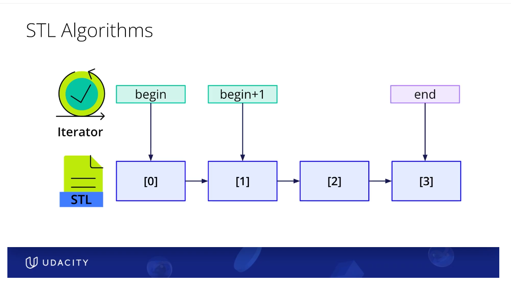
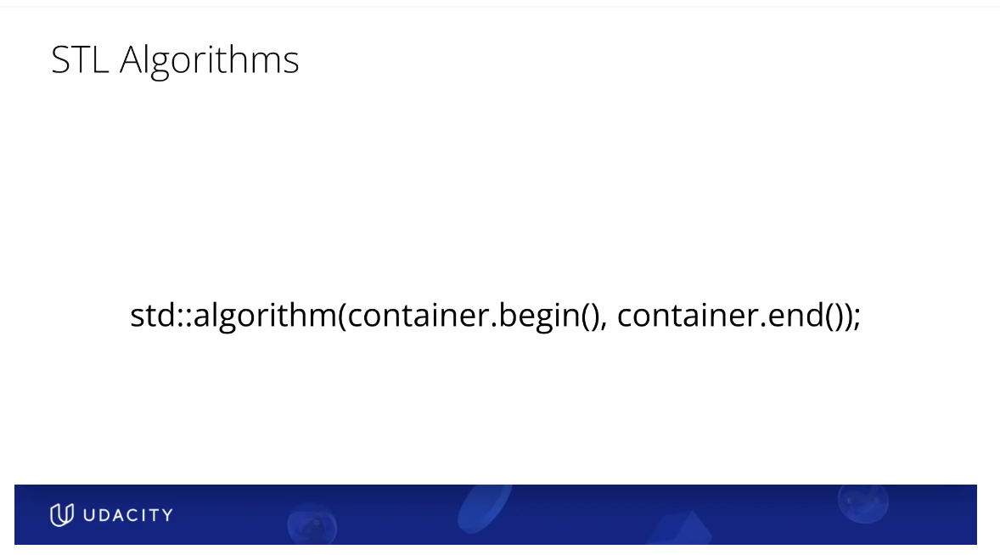

## Iterators
- iterators are pointers
- container.begin(), container.end()
- some algorithms such as "find" return iterators

## Algorithms 
- algorithms use iterators . Typically container.begin() & container.end()
- sort(data.begin(), data.end())
- reverse(num_vector.begin(), num_vector.end())
- accumulate(original.begin(), original.end(), 0)
- copy(original.begin(), original.end(), copy_target.begin());

 

