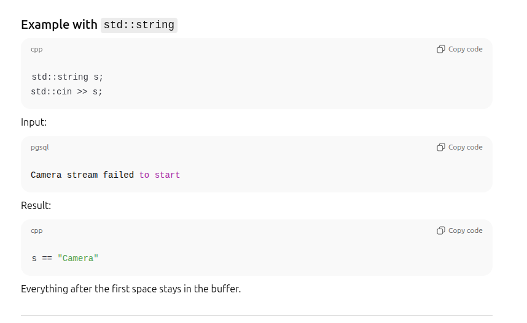
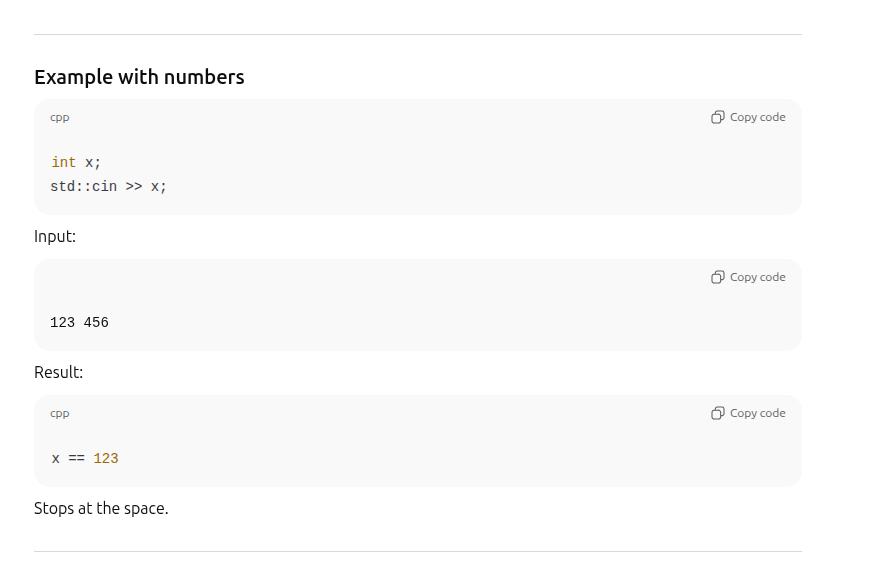

# Streams as Abstractions
- cpp uses streams to handle input and output
- streams are abstract interfaces. 
- streams let you use the keyboard, files,  and even network sockets as a continuous flow of data. So no need to manage each byte manually
- cin and cout are the most common streams that you might know already


## <iostream> , istream-ostream-iostream, cin and cout
- header: <iostream> used for input and output with the terminal. (within the std namespace)
- classes: 
    - std::istream → base class for input (reading) streams
    - std::ostream → base class for output (writing) streams
    - std::iostream → base class for input + output streams
- objects: std::cin, std::cout, std::cerr, std::clog 
- cin and cout are streams . the most common streams !
- cin is the object of the class istream. cin reads from the keyboard. cin supports >>
- cout is the object of the class ostream. cout writes to console. cout supports <<

## <sstream>, istringstream-ostringstream-stringstream, 
- KEY IDEA: string ---(read)--> stringstream object ---(write)--> string
- header: <sstream> used for input and output with strings (in memory).  (within the std namespace)
- classes : details
  - std::istringstream → read from string 
  - std::ostringstream → write to string 
  - std::stringstream  → read/write to string 
- no global like objects cin/cout. Create the objects yourself
- classes: details
  - std::istringstream → read from string 
    - derived class from istream
    - inherits all input operations (>>, getline, read, etc.)
  - std::ostringstream → write to string 
    - derived class from ostream
    - inherits all output operations (<<, write, put, etc.)
  - std::stringstream  → read/write to string 
    - derived class from iostream
    - inherits all input & output operations (>>, getline, read, etc. , <<, write, put, etc.)


## <fstream>, ifstream-ofstream-fstream, 
- KEY IDEA: file ---(read)--> filestream object ---(write)--> file
- header: <fstream> used for input and output with files (in memory).  (within the std namespace)
- classes:
  - std::ifstream → read from file 
  - std::ofstream → write to file 
  - std::fstream  → read/write to file 
- no global like objects cin/cout. Create the objects yourself
- classes :details
  - std::ifstream → read from file 
    - derived class from istream
    - inherits all input operations (>>, getline, read, etc.)
  - std::ofstream → write to file 
    - derived class from ostream
    - inherits all output operations (<<, write, put, etc.)
  - std::fstream  → read/write to file 
    - derived class from iostream
    - inherits all input & output operations (>>, getline, read, etc. , <<, write, put, etc.)

## getline: Very All Purpose :) 
- By default getline reads until it encounters a newline character (or until a demilimiter that you specify)
- Whether getline is used to extract line by line or word by word it can only work on stream objects.
- EXAMPLE-1: getline can be used to read the entire line from a file . 
  - see logs_parser_ksw_solution.cpp: 
  - here getline works on a filestream object
    ```
    while(getline(fs,line))
    ```
- EXAMPLE-2: getline can also used to be split the line into smaller strings by reading until delimiters like comma
  - see string_streams_demo.cpp 
  - here getline works on a stringstream object
    ```
    getline(ss1, serial_num_str, ',');
    getline(ss1, roll_str, ',');
    getline(ss1, pitch_str, ',');
    getline(ss1, yaw_str, ',');
    getline(ss1, radar_str, ',');
    ```
- EXAMPLE-3: you can get both line / smaller strings. But use stream objects (cannot work with raw strings). Convert line string to stream object

## Read using >> operator : stream extraction operator: 
**What >> (extraction operator) reads until**
- operator>> reads until it hits whitespace.
- But it does the skip the leading white space. It continues until it hits the next whitespace.
- Whitespace =
  - space ' '
  - tab '\t'
  - newline '\n'
  - and a few others (\v, \f)

### >> with strings


### >> with numbers


## Write using << operator : stream insertion operator: 
- Unlike the reading >> operator. Writes everything you give it to the stream.
- DOES NOT stop at spaces, commas, or newlines.
- Does not automatically add whitespace — you must add it manually if you want.
- Even special characters like \n or , are written literally.

```
std::string s = "Camera stream failed to start.";
std::stringstream ss;
ss << s;  
// ss now contains "Camera stream failed to start." (all characters, including the space)

```

Visual summary 🧠
| Operator  | Direction         | Stops at                 | Keeps spaces? |
| --------- | ----------------- | ------------------------ | ------------- |
| `<<`      | variable → stream | never                    | yes           |
| `>>`      | stream → variable | whitespace               | no            |
| `getline` | stream → string   | delimiter (default `\n`) | yes           |
