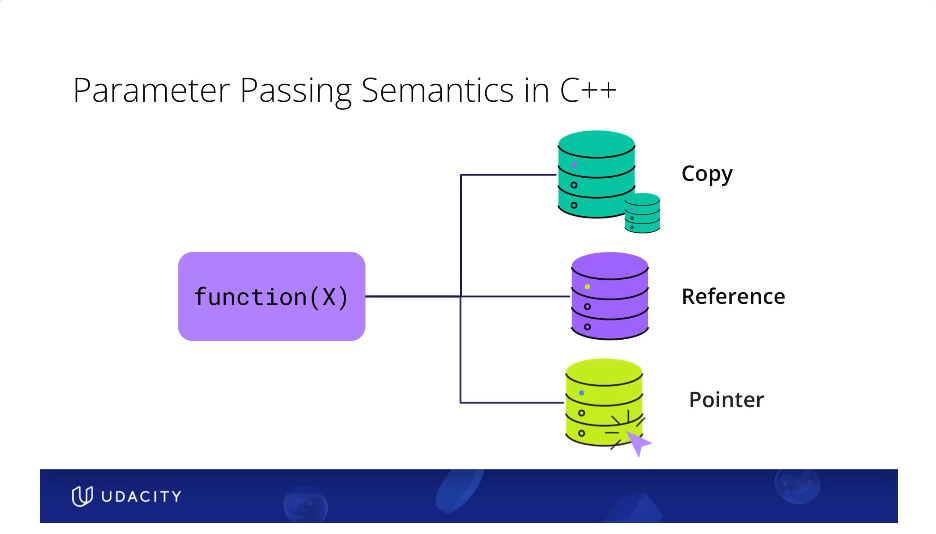
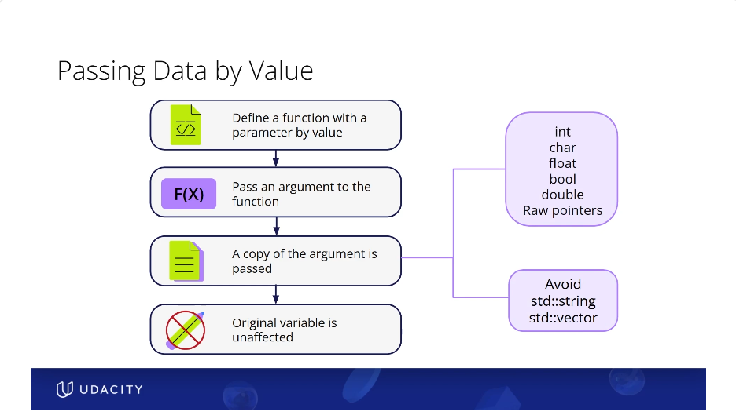
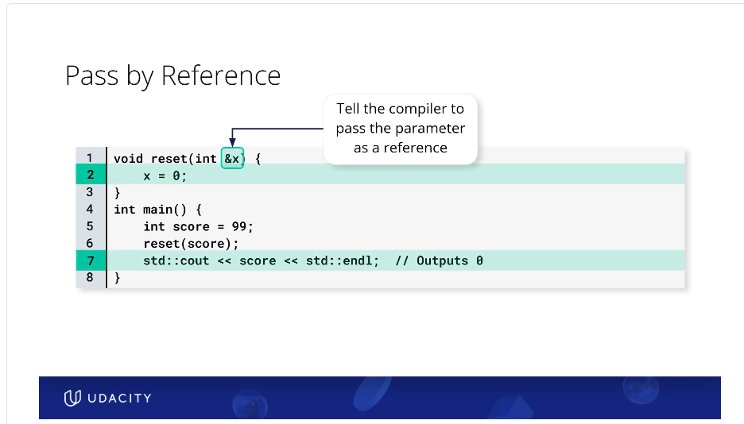
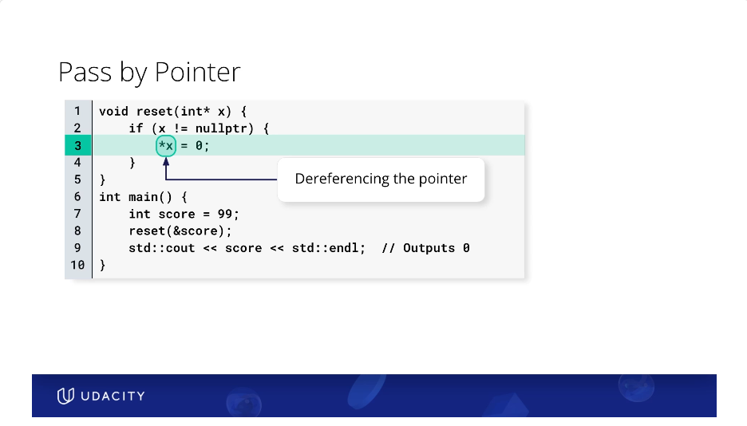
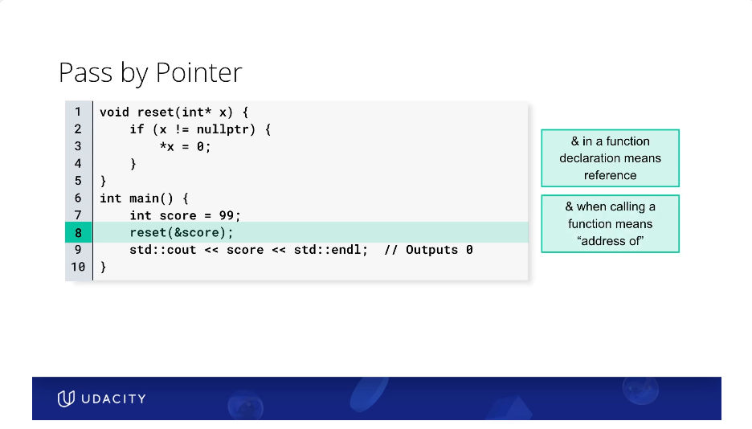
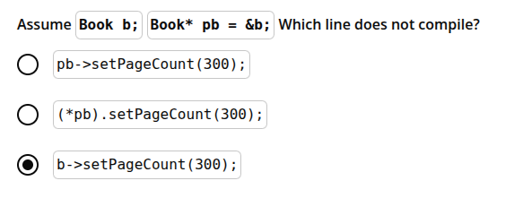
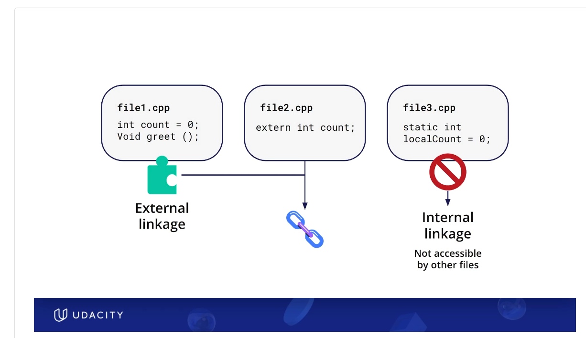
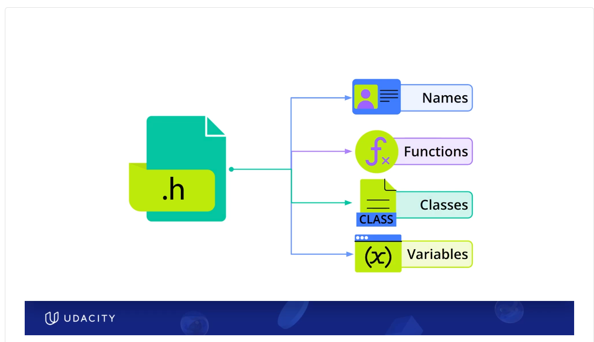

## 1. Passing Semantics
How you pass parmeters greatly affects code efficiency
- pass by value is the c++ default. But pass by reference should be preferred most of the time. use pass by pointers if pass by reference not possible



**1.1 Pass by Value**
- Creates copies. Use Pass by value only when copying is cheap, like ints etc
- do not pass by value , stls large structs etc (for these pass by refrence)
 

**1.2 Pass by Reference**
- this is the preferred way of passing things
- if for whatever reason you cannot pass by reference. you can pass by pointers. 
  - For example when you need to pass NULL. Pointers support NULL. Reference cannot be null
  - pass by reference parameters cannot be moved or reassigned to a different address in memory. pointers can be
- References are usually much simpler and safer to pass
 

**1.3 Pass by pointers**
- you would need pointers if you want to pass NULL. (references cannot be NULL)
- pointers also useful if you want to reassign to different memory address
 

**1.4 Meaning of *. Meaning of &**
- & when encountered in a function declaration / or any declaration is a reference.  (used in pass by reference)
- & when encountered in a function call(or when it shows up in the middle of a code ??) is the address of a variable ( Used in pass by pointers)
- * when encountered in a function declaration is a pointer (used i n pass by pointers)
- * when encountered in a function body is dereference in a pointer
 


## 2. POINTERS

- Pointers are not just address storing variables. They have a data type associated with them . Like pointer for int, pointer for float etc. 
- You may want a function that may receive "nothing" as an argument. Example no-book. In that case what would be the signature of the function declaration 
  - Answer: If "nothing" is an option. Think Null/ nullptr. Hence think pointers
  - Example: void rename(Book *book, const string & book_name). book is a ptr and hence could be a null ptr ie.e no book. book_name is a constant reference(do not get confused with all the * and &)
- using book.name vs book->name or book.setName() vs book->setName()




## 3 Scope and Linkage

KEY TAKE AWAY: The braces denote start and end of scope (Aha moment !)

**Difference Scope vs Linkage**
- Scope → Where a name is visible
- Linkage → Whether the same name refers to the same entity across scopes / translation units
(Is it the same person that is visible across different places, or is it a different person)

### 3.1 Example1
Notice all the 'x's and where they get printed
```
#include <iostream>

int x = 1;
int main() {
    int x = 2; 
    {
        int x = 3; 
        std::cout << x << " ";
    }
    std::cout << x << "\n";
}
```
``` 
Code output is
3 2
```
### 3.1 Example2: see constructor_destructor_scope.cpp

Notice w1 within main, within another set of braces. It cannot be accessed outside the inner braces. 

```
#include <iostream>

class Widget {
public:
    Widget() { std::cout << "C"; }  
    ~Widget() { std::cout << "D"<<std::endl; } // Note if you don't use the endl , the buffer doesnt get flushed. so it wont print the D
};

int main() {
    {
        Widget w1;
        std::cout << "M";
    }
    std::cout << "E";
    std::cout<<"\n";

    
    Widget w2;
    std::cout << "-M2-";    
    std::cout << "-E2-";
    std::cout<<"\n";

    return 0;
}
```

```
Code Output
CMD
E
C-M2--E2-
D
```

### 3.2: Scope and Linkage nuances
- static changes the linkage to internal. it doesnt change scope . 
But what does this even practically mean ??? to find out

### 3.3 External vs Internal Linkage
 

## HEADER FILES
- Header files are for declarations only. No actual implementation or definitions. \
Separate interface from implementation \
Decalaration of 
  - Functions
  - Classes
  - Names 
  - Variables


- To avoid processing the same header multiple times, you use include guards like #ifndef, #define, and #endif. This way, the compiler only includes the file once, no matter how many times it is referenced
- Each .cpp file is compiled independently into an object file. It is then linked by the linker.
Hence only .h files should be included in main or other files. including the entire .cpp file is very bad practise , since it breaks this independtly compile and then link model. 
   - kills modularity and speed benefits
   - pollutes file dependencies
   - causes duplicate definitions
