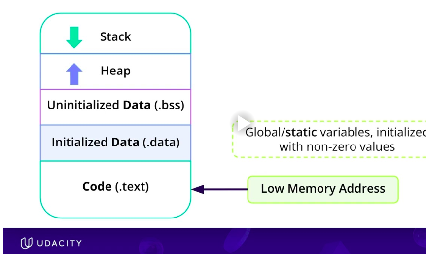
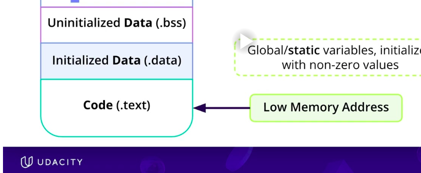
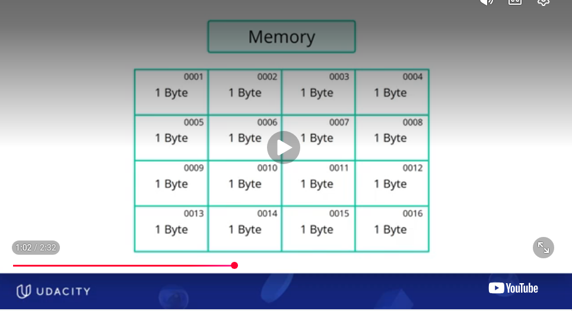

# 🎯 CITATIONS, REFERENCES
- Course material and images are based on the Udacity C++ Nanodegree.
- The README content consists of my personal notes and explanations developed while studying the course material, in conjunction with deep conversations with chatgpt 😅


# 🎯 1) C++ : VIRTUAL ADDRESS SPACE
 C++ 's Organization of Virtual Address Space

```

 High Memory Addresses
+-----------------------------+
|         Stack               |  <-- Local variables, function calls
|      (grows downward)       |  <-- Mainly function call frames  
|                             |      - return address
|                             |      - function parameters
|                             |      - local variables
|                             |      - saved registers
|                             |
|                             |
+-----------------------------+
|                             |
|     Unused / Free Space     |
|                             |
+-----------------------------+
|          Heap               |  <-- Dynamic memory (new, malloc)
|      (grows upward)         |
|                             |
|                             |
+-----------------------------+
|  BSS Segment                |  <-- Uninitialized global/static variables
+-----------------------------+
|  Data Segment               |  <-- Initialized global/static variables
+-----------------------------+
|  Read-only Data (.rodata)   |  <-- String literals, const globals
+-----------------------------+
|  Text (Code) Segment        |  <-- Executable machine instructions
+-----------------------------+
 Low Memory Addresses

 ```




 | Memory Region                | Stores                                                          | Lifetime                |
| ---------------------------- | --------------------------------------------------------------- | ----------------------- |
| **Text (Code)**              | Compiled machine instructions (functions)                       | Entire program          |
| **Read-only Data (.rodata)** | String literals, `const` global variables                       | Entire program          |
| **Data Segment**             | Initialized global and `static` variables                       | Entire program          |
| **BSS Segment**              | Uninitialized or zero-initialized global and `static` variables | Entire program          |
| **Heap**                     | Objects allocated using `new`, `new[]`, `malloc()`              | Until `delete`/`free()` |
| **Stack**                    | Function parameters, local variables, return addresses          | Until function returns  |


## 🎯 1.1) Sample Code
```
#include <iostream>

int globalVar = 10;           // Data segment
int globalUninit;             // BSS segment

const int MAX = 100;          // Read-only data (often)

void foo()
{
    static int counter = 0;   // Data segment

    int x = 5;                // Stack
    int arr[100];             // Stack

    int *p = new int(20);     // p on stack, object on heap

    delete p;
}

int main()
{
    foo();
}
```

## 🎯1.2 Important Note: Pointers & New:  Where are they stored ?
Notice something important:
```
int *p = new int(20);
```
There are actually two things here:
- p (the pointer variable) lives on the stack because it is a local variable.
- *p (the integer allocated by new) lives on the heap.

```
Stack                     Heap
------+                   +------+
| p | ------------------> | 20 |
------+                   +------+
```

**In Greater Detail**
```
                STACK                              HEAP
+-------------------------------+      +-------------------------------+
| Variable | Address | Value    |      | Variable | Address | Value    |
+----------+---------+----------+      +----------+---------+----------+
| p        |7FFE1000 |10002000  |----->| *p       |10002000 |20        |
+----------+---------+----------+      +----------+---------+----------+

```


# 🎯 2) STATIC  MEMORY AREAS



- By static memory , we dont mean the area for statically allocated stuff such as int, float etc
- We mean the area in the virtual address space that does not change size. **💡 ONCE SPACE HAS BEEN ALLOCATED FOR THIS . IT DOES NOT CHANGE IN SIZE OR PURPOSE** . Global variables, static variables remain alive through the lifetime of the programme. Code of course will remain alive throughout
- The static memory areas from top to bottom are. 
    - uninitialized data (.bss):       
      - this is for global variables , static variables that are **UNINITIALIZED OR ZERO (or zero equivalent like NULL POINTER)**. 
      - BSS MEANS Block Started by Symbol, old assembly language directive.  
    - initialized data (.data): 
      - global variables, static variables that are explicitly initialized to **NON-ZERO VALUES**
    - code(.text): read only area
- Together the .text, .bss, .data provide the stable foundation for the code and long lived data needed for the programme. 


# 🎯 2) DYNAMIC MEMORY AREAS


- By dynamic memory , we *DON'T ONLY ** mean the area for PROGRAMMATICALLY dynamically allocated stuff such as new/delete malloc/free. 
- We mean the area in the virtual address space that keeps changing in size & purpose. This includes both 
  - STACK: for statically allocated ints, floats, class objects and function call stacj


## 🎯 2.1) STACK ALLOCATIONS
  - the progammatically static memory allocations such as ints, floats, class objects, etc. These are on the STACK. 
  - actually the stack is mainly for the **FUNCTION CALL STACK** : The stack holds ints, floats, class objects, etc local to the function. If you think about it main is also a function
  - The stack keeps growing and shrinking bassed on the ints, floats, or even class objects are getting created and deleted (depending on the scope & lifetime of the variable.). 
  - If the stack has to grow, it grows downwards towards lower memory addresses
  - The stack is optimized for speed for short lived data
  
    
## 🎯 2.2) HEAP ALLOCATIONS 
  - the progammatically dynamic memory allocations such as new. could be new int, new floats , or even new class objects. These are on the HEAP. 
  - The **LIFETIME IS CONTROLLED BY THE PROGRAMMER**: If the lifetime of the variable is done and you - the programmer forgets to release it, it causes a **MEMORY LEAK**
  - The heap keeps growing and shrinking based on the new / delete (or smart pointer controls it). 
  - If the heap has to grow, it grows upwards towards higher memory addresses
  - **MEMORY ALLOCATOR:**  
      ```
      PROGRAMME <-----> MEMORY ALLOCATOR (manages heap)  <--------> OPERATING SYSTEM
      ```
      - The C++ programme requests memory from the system during runtime for heap variables. (You do not know at compile time how much memory is needed). 
      - but everytime you call 'new' the programme doesnt grab memory directly from the operating system. Instead the programme talks to a component of the c++ runtime library called **memory allocator**. 
      - The memory allocator sits in between the programme and the operating system and manages the heap, releases heap memory, asks the os for more heap memory, . It manages using free lists

## 🎯 2.3) STACK : PROBLEMS
### 🎯 2.3.1) STACK : FAMOUS PROBLEMS
- **😈 1. STACK OVERFLOW** : The most common stack problem is  . The stack runs out of space/ stack grows beyond its allocated region. It can occur
    - if you allocate a very large array (RARE)
    - very deep recursion (MOST COMMON CAUSE)
      ```
          void recurse()
          {
              recurse();
          }
      ```

- **STACK OVERFLOW - DIAGNOSIS: GDB** : 
  - When a stack overflow occurs the code just ends abruptly
  - Can be diagnosed using GDB, you can traceback at what point the code exited and keep stepping backwards

### 🎯 2.3.2) STACK : LESS FAMOUS PROBLEMS
- **😈 2. STACK BUFFER OVERFLOW**: writing beyond a stack-allocated array.
   ```
    void foo()
    {
        int arr[10];
        arr[100] = 5;
    }
  ```

- **😈 3. INVALID STACK POINTER** : 
 That address doesn't belong to your program.
  ```
  int* p = (int*)0x12345678;
  *p = 5;
  ```


## 🎯 2.4) HEAP : PROBLEMS
### 🎯 2.4.1) HEAP: FAMOUS PROBLEMS
- **e 👹 1) MEMORY LEAK** : the most common problem is Memory Leak. The programmer forgot to delete a variable that is no longer needed
- **MEMORY LEAK: DIAGNOSIS: VALGRIND** : valgrind to diagnose memory leaks


### 🎯 2.4.2) HEAP: LESS FAMOUS PROBLEMS
- **e 👹 2) HEAP OVERFLOW / OUT OF MEMORY**: Heap overflow can occur. But this is called out of memory error
- **e 👹 3) HEAP BUFFER OVERFLOW** : Writing beyond the allocated heap block.
    ```
    int* arr = new int[10];
    arr[100] = 5;
    ```
- **e 👹 4) DANGLING HEAP POINTER/ USING A FREED HEAP POINTER** : 
  ```
  int* p = new int(42);
  delete p;
  *p = 10;      // Invalid
  ```


## 🎯 2.5) SEGMENTATION FAULT: HEAP & STACK
- Segmentation fault just means invalid/ illegal memory access. 
- It could occur due to any of the following reasons. But Memory Leak is not one of them
- can occur on the heap or stack

| Problem               | Segmentation Fault? |
| --------------------- | ------------------- |
| Null pointer          | ✅ Yes               |
| Stack overflow        | ✅ Usually           |
| Heap buffer overflow  | ✅ Often             |
| Stack buffer overflow | ✅ Often             |
| Use-after-free        | ✅ Often             |
| Invalid pointer       | ✅ Yes               |
| Memory leak           | ❌ No                |


# 🎯 3) CPP POINTERS : WHERE DO THEY LIVE ? HEAP OR STACK

Now that we are talking about Memory, Heap , Stack etc, Pointers come to mind. And its also a source of confusion. Because pointers are memory storing variables, my mind often tricks me into thinking pointers only deal with Dynamically Allocated Memory i.e THE HEAP. That the pointers themselves live on THE HEAP and they point to data on THE HEAP. ❌ This of course is **NOT TRUE**. Lets sort this confusion !
QUESTION: 
- Where are the pointers. Are they on the Heap or Stack ?
- Where is the data that they point to. Is it on the Heap os Stack ?

See README_memory_management_cpp_pointers.md


# 🎯 4. MEMORY AS ADDRESSABLE UNITS

- **1. THE SMALLEST UNIT OF MEMORY IS A BYTE = 8bits** 
  - virtually all modern computers, the smallest addressable unit of memory is one byte (8 bits).
  - This byte-addressable memory model is what C and C++ assume on mainstream architectures such as x86, x86-64, and ARM

- **2. ADDRESS REPRESENTATION: 64 BITS = 8 bytes**
  - The address itself is 64 bits long = 8 BYTES (on a 64 bit system)** 
  - Each address is 64 bits long (on a 64 bit system)
  - 64binary bits is too long. easier to represent as hexadecimal for every 4 bits. (This is middle school math, you know this !)
  - every 4 binary digits/bits is one hexadecimal character
    ```
    64bit hexadecimal :  A7F3-C91E-5D42-1230
    64bit binary value : 10100111-11110011-11001001-00011110   01011101-01000010-00010010-00110000
    ```

- **3. INCREMENTING ADDRESS LOCATIONS: BY 1 (NOT BY 8)**
  - Each address location gets incremented by 1 (not 8) 
  - because it is the address / house number of the byte. Its like house numbers get incremeted by 1
  - ❌  it **DOES NOT** get incremeted by 8 bits .
  - I found this part confusing and hard to believe/ convince myself. If you find yourself unconvinces, you can have deep conversations with chatgpt/ claude/ gemini and sort this out  😂🤣
      ```
      Imagine apartment numbers
      Apartment 1230
      Apartment 1231
      Apartment 1232
      Apartment 1233

      Now the same thing in byte addresses increasing by 1 byte
      0xA7F3-C91E-5D42-1230
      0xA7F3-C91E-5D42-1231
      0xA7F3-C91E-5D42-1232
      0xA7F3-C91E-5D42-1233
      ```

**⚠️ RE-READ PTS 1, 2,3 above. It is a very common point of confusion . The the size of the location(8bits), the number of bits in an address(64bits),  and the value to increment the address byte (1) are three different concepts.**




### 💡 How many bytes in various datatypes ?
- int32 : 32 bits = 4 bytes
- int16 : 16 bits = 2 bytes
- int8  :  8 bits = 1 byte
- int4  :  4 bits = 0.5 byte. This would need half a byte. But the smallest memory unit is a byte. So how does int4 work ?
- float : 32 bits = 4 bytes
- double: 64 bits = 8 bytes

### 💡 HOW DOES INT4 (half a byte) WORK if 1 BYTE is THE SMALLEST UNIT OF MEMORY ?
A short summary is:

**Memory is byte-addressable, not type-addressable. INT4 works by packing two 4-bit values into a single byte.**

- Memory addresses still point to 1 byte (8 bits).
- An INT4 value occupies only half of a byte, so it cannot have its own address.
- Instead, two INT4 values are packed into one byte.
- During inference, the CPU/GPU/NPU reads the byte and unpacks the two INT4 values before performing computations.
- Specialized AI hardware can unpack and process many INT4 values in parallel, making INT4 both memory-efficient and fast.**


## --------------------------------------THE END -----------------------------------------