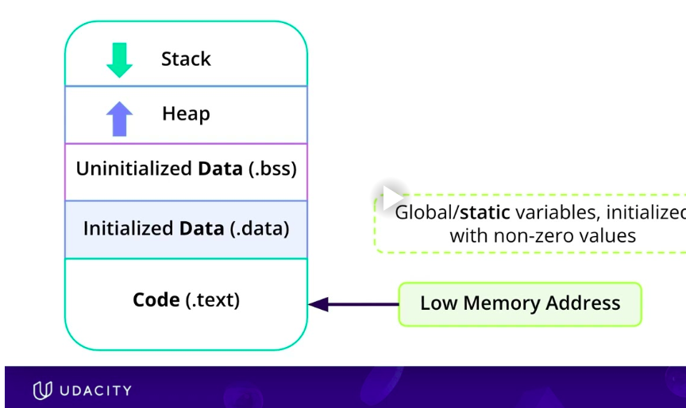
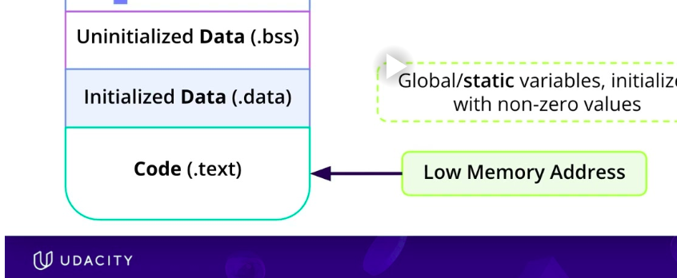

# 🎯 CITATIONS, REFERENCES
- Course material and images are based on the Udacity C++ Nanodegree.
- The README content consists of my personal notes and explanations developed while studying the course material, in conjunction with deep conversations with chatgpt 😅


# 🎯 1) C++ : VIRTUAL ADDRESS SPACE
 C++ 's Organization of Virtual Address Space

```

 High Memory Addresses
+-----------------------------+
|         Stack               |  <-- Local variables, function calls
|      (grows downward)       |  <-- Mainly function call frames  
|                             |      - return address
|                             |      - function parameters
|                             |      - local variables
|                             |      - saved registers
|                             |
|                             |
+-----------------------------+
|                             |
|     Unused / Free Space     |
|                             |
+-----------------------------+
|          Heap               |  <-- Dynamic memory (new, malloc)
|      (grows upward)         |
|                             |
|                             |
+-----------------------------+
|  BSS Segment                |  <-- Uninitialized global/static variables
+-----------------------------+
|  Data Segment               |  <-- Initialized global/static variables
+-----------------------------+
|  Read-only Data (.rodata)   |  <-- String literals, const globals
+-----------------------------+
|  Text (Code) Segment        |  <-- Executable machine instructions
+-----------------------------+
 Low Memory Addresses

 ```




 | Memory Region                | Stores                                                          | Lifetime                |
| ---------------------------- | --------------------------------------------------------------- | ----------------------- |
| **Text (Code)**              | Compiled machine instructions (functions)                       | Entire program          |
| **Read-only Data (.rodata)** | String literals, `const` global variables                       | Entire program          |
| **Data Segment**             | Initialized global and `static` variables                       | Entire program          |
| **BSS Segment**              | Uninitialized or zero-initialized global and `static` variables | Entire program          |
| **Heap**                     | Objects allocated using `new`, `new[]`, `malloc()`              | Until `delete`/`free()` |
| **Stack**                    | Function parameters, local variables, return addresses          | Until function returns  |


## 🎯 1.1) Sample Code
```
#include <iostream>

int globalVar = 10;           // Data segment
int globalUninit;             // BSS segment

const int MAX = 100;          // Read-only data (often)

void foo()
{
    static int counter = 0;   // Data segment

    int x = 5;                // Stack
    int arr[100];             // Stack

    int *p = new int(20);     // p on stack, object on heap

    delete p;
}

int main()
{
    foo();
}
```

## 🎯1.2 Important Note: Pointers & New:  Where are they stored ?
Notice something important:
```
int *p = new int(20);
```
There are actually two things here:
- p (the pointer variable) lives on the stack because it is a local variable.
- *p (the integer allocated by new) lives on the heap.

```
Stack                     Heap
------+                   +------+
| p | ------------------> | 20 |
------+                   +------+
```

**In Greater Detail**
```
                STACK                              HEAP
+-------------------------------+      +-------------------------------+
| Variable | Address | Value    |      | Variable | Address | Value    |
+----------+---------+----------+      +----------+---------+----------+
| p        |7FFE1000 |10002000  |----->| *p       |10002000 |20        |
+----------+---------+----------+      +----------+---------+----------+

```
\
\
\

# 🎯 2) STATIC  MEMORY AREAS



- By static memory , we dont mean the area for statically allocated stuff such as int, float etc
- We mean the area in the virtual address space that does not change size. **💡 ONCE SPACE HAS BEEN ALLOCATED FOR THIS . IT DOES NOT CHANGE IN SIZE OR PURPOSE** . Global variables, static variables remain alive through the lifetime of the programme. Code of course will remain alive throughout
- The static memory areas from top to bottom are. 
    -**uninitialized data (.bss):**     
      - this is for global variables , static variables that are **UNINITIALIZED OR ZERO (or zero equivalent like NULL POINTER)**. 
      - BSS MEANS Block Started by Symbol, old assembly language directive.  
    - **initialized data (.data):**
      - global variables, static variables that are explicitly initialized to **NON-ZERO VALUES**
    - code(.text): read only area
- Together the .text, .bss, .data provide the stable foundation for the code and long lived data needed for the programme. 

\
\
\

# 🎯 3) DYNAMIC MEMORY AREAS


- By dynamic memory , we *DON'T ONLY ** mean the area for PROGRAMMATICALLY dynamically allocated stuff such as new/delete malloc/free. 
- We mean the area in the virtual address space that keeps changing in size & purpose. This includes both 
  - STACK: for function call stack & for statically allocated ints, floats, class objects within the call stack 
  - HEAP: for dynamically allocated ints, floats, class objects etc.

\
\

## 🎯 3.1) STACK ALLOCATIONS
  - the progammatically static memory allocations such as ints, floats, class objects, etc. These are on the STACK. 
  - actually the stack is mainly for the **FUNCTION CALL STACK** : The stack holds ints, floats, class objects, etc local to the function. If you think about it main is also a function
  - The stack keeps growing and shrinking bassed on the ints, floats, or even class objects are getting created and deleted (depending on the scope & lifetime of the variable.). 
  - If the stack has to grow, it grows downwards towards lower memory addresses
  - The stack is optimized for speed for short lived data
  
\
\
  
## 🎯 3.2) HEAP ALLOCATIONS 
  - the progammatically dynamic memory allocations such as new. could be new int, new floats , or even new class objects. These are on the HEAP. 
  - The **LIFETIME IS CONTROLLED BY THE PROGRAMMER**: If the lifetime of the variable is done and you - the programmer forgets to release it, it causes a **MEMORY LEAK**
  - The heap keeps growing and shrinking based on the new / delete (or smart pointer controls it). 
  - If the heap has to grow, it grows upwards towards higher memory addresses
  - **MEMORY ALLOCATOR:**  
      ```
      PROGRAMME <-----> MEMORY ALLOCATOR (manages heap)  <--------> OPERATING SYSTEM
      ```
      - The C++ programme requests memory from the system during runtime for heap variables. (You do not know at compile time how much memory is needed). 
      - but everytime you call 'new' the programme doesnt grab memory directly from the operating system. Instead the programme talks to a component of the c++ runtime library called **memory allocator**. 
      - The memory allocator sits in between the programme and the operating system and manages the heap, releases heap memory, asks the os for more heap memory, . It manages using free lists


## 🎯 3.3) STACK & HEAP: COMMON PROBLEMS 
See [c3_memory_management/docs/README_4_code_debugging.md](README_4_code_debugging.md)
\
\

## 🎯 3.4) STACK & HEAP: DEBUGGING THE PROBLEMS
See [c3_memory_management/docs/README_4_code_debugging.md](README_4_code_debugging.md)
\
\

## 🎯 3.5) STACK & HEAP: AVOIDING PROBLEMS/ GOOD CODE PRACTICES
See [c3_memory_management/docs/README_3_modern_cpp_pointer_management.md](README_3_modern_cpp_pointer_management.md)

\
\

## --------------------------------------THE END -----------------------------------------