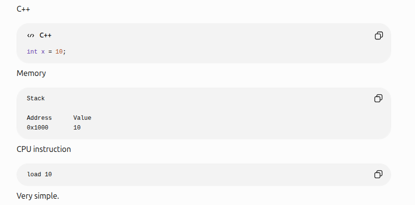
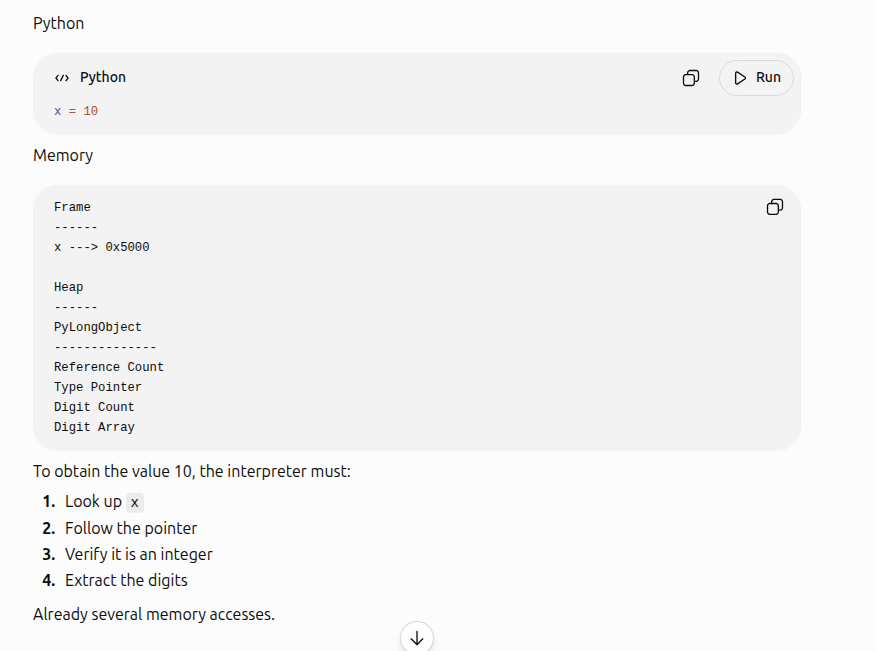
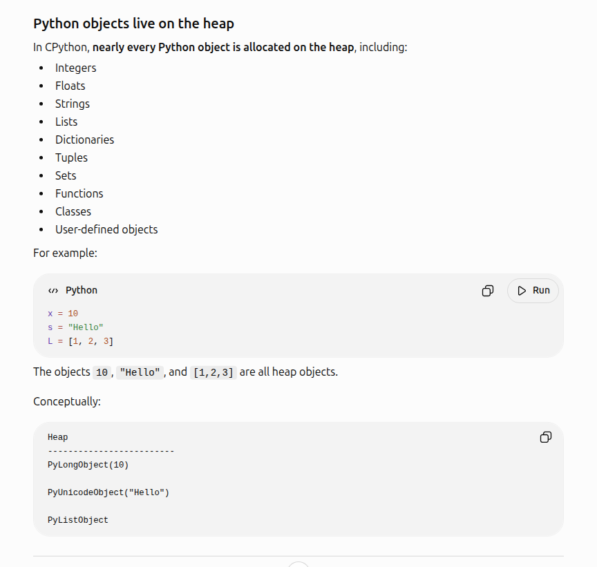
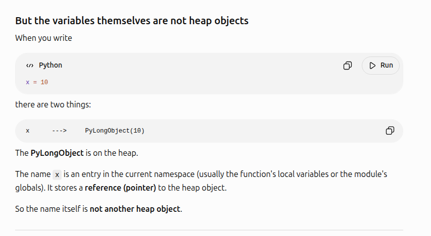

# 🎯 1) Python's Organization of Virtual Address Space

## 🎯 1.1) Does Python Organize the Virtual Space like C++ ? \
Yes it organizes the virtual space like c++ does. This is because the Python Interpreter is Cpython - a cprogramme
- Stack
- Heap
- Data Segment : .bss for static and global variables
- Code Segment: . text for code

The key differences are 
- who manages the lifetime of the variables
- most of the python variables and objects are stored on the HEAP (yes heap, not on the stack). In c++ only the dynamically allocated variables are allocated on the heap/ stack. see section 2.2
- what is stored in the stack , heap, data, code segments. It not what you think. see section 2.3

## 🎯 1.2) Who manages memory
**C++ : STATICALLY ALLOCATED OBJECTS**
- C++ compiler manages layout for statically allocated objects
- c++ runtime manages the lifetime of statically allocated objects

**C++ : DYNAMICALLY ALLOCATED OBJECTS**
- the programmer manages the lifetime of dynamically allocated objects (usine new/delete, malloc/free). Modern C++ uses smart pointers though

**PYTHON**
- Python interpreter(Cpython) takes care of everything
- **Reference counting:** Frees an object immediately when its reference count becomes zero.
- **Cyclic garbage collector:** Periodically finds and frees groups of objects involved in reference cycles that reference counting alone cannot reclaim.

## 🎯 1.3) Python Objects are Heap Allocated
There are really two parts to this
- In Python everything is an object. Like even simple floats, ints, strings etc are not simple primitie data types. They are all objects
- All the objects / Most objects are allocated on the heap

**CPP: int x on STACK**

 

**Python: x is on HEAP**

 

**Python: More Examples. Everything is an Object. Everything on the Heap**

 


### 1.3.1) The Variable Name Is on The Stack

**Python: Subtelety. Variable name on STACK**
- Variable Name Itself on Stack: x
- Pyobject on Heap: pyobject



## 🎯 1.4) Python has no concept of static and dynamic variables . So what is stored in the data segment ?
So the data segment does not have python programmes variables , because python has no concept of static variables etc. Also if u still havent caught onto the main idea- all python variables are objects that live on the heap
- so the data segment : static / global initialized: this stores the Python Interpreter: Cpython's 
- Initialized globals & static (.data)	❌ Not for Python variables ✅ Python Interpreter- CPython's own initialized global/static variables	
- Uninitialized globals (.bss)	❌ Not for Python variables ✅ Python Interpreter- CPython's own uninitialized global/static variables	

**❌ PYTHON VARIABLES NEVER LIVE IN .bss & .data SECTIONS**

**Mental Model**

Think of C++ like this:
```
Executable
│
├── .text
├── .data    <-- your globals
├── .bss     <-- your globals
├── Heap
└── Stack
```

Python

```
CPython Executable
│
├── .text
├── .data      <-- CPython's own C globals
├── .bss       <-- CPython's own C globals
├── Heap
│     ├── Python objects
│     ├── Module dictionaries
│     ├── Lists
│     ├── Strings
│     ├── Integers
│     └── Frames
└── Stack
```

```
| Memory Region                | C++ Program                    | Python Program                                   |
| ---------------------------- | ------------------------------ | ------------------------------------------------ |
| Code (.text)                 | ✅ Your functions               | ✅ CPython interpreter + compiled Python bytecode |
| Initialized globals (.data)  | ✅ Your global/static variables | ❌ Not for Python variables                       |
| Uninitialized globals (.bss) | ✅ Your global/static variables | ❌ Not for Python variables                       |
| Heap                         | Objects from `new`             | ✅ Almost all Python objects                      |
| Stack                        | Function locals                | ✅ Call frames and interpreter state              |
```


## 🎯 1.5) Why is Python SLOWER than C++
Yoou should know by now. Because of all of the above
- everything is an object
- all objects on the heap
- so much over head 
    - Every operation checks types (because the types are not known ahead of time)
    - reference counting 
    - python interepreter overhead

Here are the additional / comprehensive compilation of reasons


| Operation                        | C++              | Python (CPython)                            |
| -------------------------------- | ---------------- | ------------------------------------------- |
| Integer stored directly          | ✅ Usually        | ❌ No (wrapped in a Python object)           |
| Heap allocation for most objects | Only when needed | Almost everything                           |
| Reference counting               | ❌                | ✅ Every assignment updates reference counts |
| Dynamic type checking            | ❌                | ✅ Every operation                           |
| Function call overhead           | Low              | High                                        |
| Compiler optimization            | Aggressive       | Limited at runtime                          |
| Pointer indirection              | Minimal          | Much more                                   |


