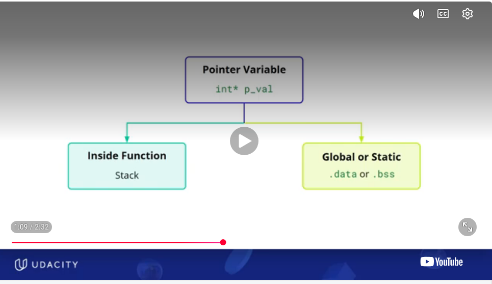
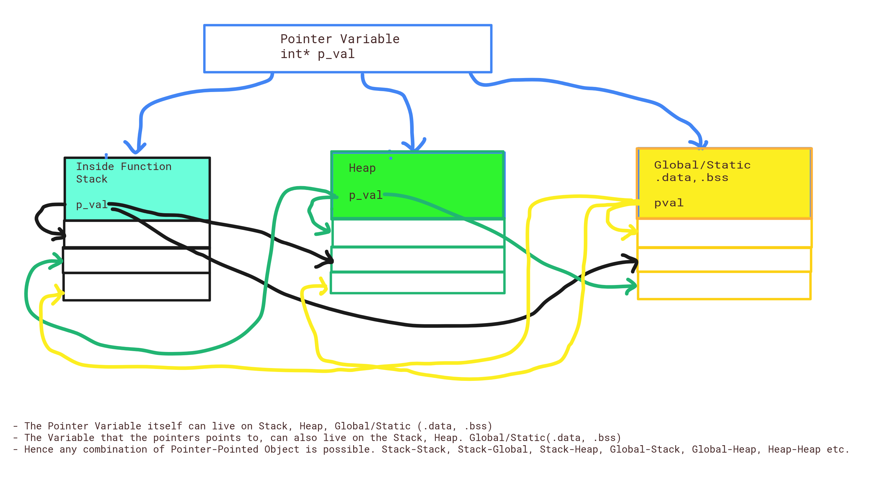

# 🎯 CPP POINTERS
This entire readme deals with pointers in c++ only

# 🎯 1) CPP POINTERS : WHERE DO THEY LIVE ? HEAP OR STACK
Now that we are talking about Memory, Heap , Stack etc, Pointers come to mind. And its also a source of confusion. Because pointers are memory storing variables, my mind often tricks me into thinking pointers only deal with Dynamically Allocated Memory i.e THE HEAP. That the pointers themselves live on THE HEAP and they point to data on THE HEAP. ❌ This of course is **NOT TRUE**. Lets sort this confusion !
\
QUESTION: 
- Where are the pointers. Are they on the Heap or Stack ?
- Where is the data that they point to. Is it on the Heap os Stack ?
\



The above udacity diagram is not complete , since pointers can live on the heap as well. 

ANSWER:
- Pointers can live anywhere: Stack, Heap,. They can even live on Global-Static Data (.bss, .data sections)
- The memory that they point to can live anywhere as well. Stack, Heap. It can also be on the Global-Static Data (.bss, .data sections)
- Hence any combination of Pointer-Pointed Variable is possible. stack-stack, stack-heap, heap-heap . global-data region-stack, globaldata-heap.
- See examples below for code samples and memory layout diagrams (although I dont know where you will need this level of detail 😂🤣)




NOTE: 💡
- The following examples use new , for the purpose of demonstration and for the sake of demonstrating pointers in various locations,  memory leaks,  and dangling pointers. 
- But modern C++ never uses new. Modern C++ relies on the principle of Resource Acquisition Is Initialization (RAII) and smart pointers to handle memory automatically.

### 💡 Example 1.1: pointer on stack, object on stack
- pointer on stack
- object pointer points to is also on stack
  ```
  int main()
  { 
    int a =10 ;  // a is on stack
    int* p1 ;    // pointer itself is on the stack
    p1 = &a  ;   // pointer to a stack variable

    Student s1;  // s1 is on stack
    Student* p2; // pointer itself is on the stack
    p2 = &s1;    // pointer to a stack object

  }
  ```

**Memory Layout:**
  ```
  Stack

  +----------------------+
  | a = 10               |
  +----------------------+
  | p ------------------+|
  +----------------------+
                        |
                        |
                        +-------> a
  ```


### 💡 Example 1.2: pointer on stack, object on heap
- pointer on stack
- object pointer points is on heap
one of the most important concepts in c++ is
- delete does not delete the pointer itself
- it deletes the memory that the pointer points to
- once the memory is freed p1 still points to that freed memory. This would create a **DANGLING POINTER**
- hence p1 = nullptr **AVOIDS THE DANGLING POINTER**
  ```
  int main()
  { 
    int* p1 ;           // pointer itself is on the stack
    p1 = new int  ;     // *p1 is on heap
    *p1 = 10    
    delete p1 ;         // important to free heap memory. this does not delete p1 though
    p1 = nullptr        // good practise, so that p1 doesnt become a dangling pointer

    Student* p2;        // pointer itself is on the stack
    p2 = new Student(); // *p2 on heap
    delete p2 ;         // important to free heap memory. this does not delete p2 though
    p2 = nullptr        // good practise, so that p2 doesnt become a dangling pointer


  // p1 and p2  the pointers would get deleted right here. right before the end of main
  }
  ```

**Memory Layout:**

```
Stack                            Heap

+-----------------+           +---------+
| p1 = 0x1000 ----|  ------>  |   10    |
+-----------------+           +---------+

```

### 💡 Example 1.2: MEMORY LEAK DISCUSSION
Question : Now in the same example above what if we dont release heap memory pointed by p1 and p2. 
- Would that memory never be released even after the program terminates ?
- Would this could be a code with memory leak  ?

  ```
  int main()
  { 
    int* p1 ;           // pointer itself is on the stack
    p1 = new int  ;     // *p1 is on heap
    *p1 = 10 
  
    Student* p2;        // pointer itself is on the stack
    p2 = new Student(); // *p2 on heap

  }
  ```

Answer:
- The memory would be released after the program termninates by the **OPERATING SYSTEM. IT IS NOT RELEASED BY THE PROGRAM ITSELF**. Hence this is bad code, and hence it is a memory leak as well. This distinction is the key reason why C++ requires you to manually delete memory allocated with new (unless you use smart pointers like std::unique_ptr or std::shared_ptr, which automate this).
- Yes this would be a memory leak. Because during the lifetime of this program there were sections in the heap memory that was once allocated and pointed to by a pointer and remained inaccessible . **THE C++ PROGAM LEAKED MEMORY DURING EXECUTION**
- Imagine this piece of code was inside a function or it ran on a server. Then the heap memory would not be released at the end of the function. The memory that was reserved but remained inaccesible (MEMORY LEAK) would continue to grow until you are out of memory

```
void demo_function(){
      int* p1 ;           // pointer itself is on the stack
    p1 = new int  ;     // *p1 is on heap
    *p1 = 10 
  
    Student* p2;        // pointer itself is on the stack
    p2 = new Student(); // *p2 on heap
}

// no the heap memory pointed to p1 and p2 would not be released at the end of the demo_function() , no not even here
```


### 💡 Example 1.3: pointer on heap, object on heap 
This is essentially a pointer to a pointer for the purpose of demonstration
- pp on stack. pp is a pointer to a pointer
- pp points to new int*.  new int* is the second pointer here and it is on heap
- *(new int*) points to an integer on the heap

```
int main() {
  int **pp;        // pp is a pointer to a pointer. pp is on the stack
  
  pp = new int*;  // pp points to a pointer on the heap. new int* is the second pointer here and it is on heap
  *pp = new int;  // *(new int*) points to an integer on the heap
  **pp = 10;

  delete *pp;
  *pp = nullptr;

  delete pp;
  pp = nullptr;
}
```    

**Memory Layout:**
```
Stack                                   Heap

+--------------------+                  +----------------------+
| pp --------------+ |----------------->| int* -------------+  |
+--------------------+                  +-------------------|--+
                                                            |
                                                            |
                                         +------------------v---+
                                         | int = 10            |
                                         +----------------------+
```

### 💡 Example 1.4:
In practice, you rarely allocate a standalone pointer on the heap. A much more common case is a pointer inside a heap-allocated object:
- pointer on stack
- Node Object on the heap
- the next pointer within the node object is also on the heap
```
Class Node {
  public:
  int number;
  Node *next ;
}

int main(){
   
   Node *node_p = new Node();
   delete node_p; 
}
```


**Memory Layout:**

```
        Stack                                                   Heap

+------------------------------+       +--------------------------------------+
| node_p                       | ----> | Node object                          |
| (pointer on the stack)3299999999999999999999999999999999999999999999999999999999999999999999999999999999999999999999999999999999999999999999999999999999999999999999999999999999999999999999999999999999999999999999999999999999999999999999999999999999999999999       |       |                                      |
+------------------------------+       | number : int                         |
                                       | next   : Node* (pointer on the heap) |
                                       +--------------------------------------+
```


### 💡 Example 1.5: Examples like this are commonly encountered

In practice, you rarely allocate a standalone pointer on the heap. A much more common case is a pointer inside a heap-allocated object:
- s1 and s2 are pointer variables on the stack.
- Both Student objects are on the heap.
- friendPtr is also on the heap because it is a member of a heap-allocated Student.
This is the pattern you'll encounter most often in linked lists, trees, graphs, and other dynamic data structures.


```
struct Student
{
    int age;
    Student* friendPtr = nullptr;
};

int main()
{
    Student* s1 = new Student;
    Student* s2 = new Student;

    s1->friendPtr = s2;

    delete s2;
    s2 = nullptr;
    s1->friendPtr = nullptr;

    delete s1;
    s1 = nullptr;
}
```

**Memory Layout:**

```
Stack                                 Heap

+----------------+            +----------------------+
| s1 -----------+|----------->| Student              |
+----------------+            | friendPtr --------+  |
                              +-------------------|--+
                                                  |
+----------------+                                |
| s2 -----------+|--------------------------------+
+----------------+            +----------------------+
                              | Student              |
                              +----------------------+

```


### 💡 Example 1.6: Example 5 reimagined as Global Data
NOTE: There is no longer a stack


```
struct Student
{
    int age;
    Student* friendPtr = nullptr;
};

Student* s1 ;
Student* s2 ;

int main()
{
    s1 = new Student;
    s2 = new Student;

    s1->friendPtr = s2;

    delete s2;
    s2 = nullptr;
    s1->friendPtr = nullptr;

    delete s1;
    s1 = nullptr;
}
```

**Memory Layout:**

```
Global/Static Data(.bss)                        Heap

+--------------------------+            +----------------------+
| s1 ---------------------+|----------->| Student              |
+--------------------------+            | friendPtr --------+  |
                                        +-------------------|--+
                                                            |
+--------------------------+                                |
| s2 ---------------------+|--------------------------------+
+--------------------------+            +----------------------+
                                        | Student              |
                                        +----------------------+

```


### 💡 Example 1.7: Static pointer → Static data

Again, the pointer is not on the stack.

```
void foo()
{
    static int* p = new int(10);
}
```

**Memory Layout:**

```
Static Data                 Heap

+----------------+       +---------+
| p ----------+  |------>|   10    |
+----------------+       +---------+
```

\
\


# 🎯 2) POINTERS & HEAP MEMORY
- dynamic memory is almost always accessed using pointers in c++ 😅
- This is the reason why , when you think of pointers, you almost alway think of dynamic memory (even though based on section 1 pointers can live any where and point to stack, heap or global) 
- You could use references,  but they are tricky. But nevertheless the reference is obtained by dereferencing a pointer. you would need a pointer anyway 

## 🎯 2.1) POINTERS TO HEAP MEMORY
- - In C++ avoid using raw pointers like new/delete. Use smart pointers instead
 - p = new int, delete p. In C++ if you use new , every new should be accompanied by delete
 - p = new int[5]. delete[] p . In C++ if you use new[] every new[] should be accompanied by delete[] (pay attention to [])
 - malloc, callon: free. In C every malloc should be accompanied by free. Every calloc should be accompanied by free
 
## 🎯 2.2) REFERENCES TO HEAP MEMORY
- See T2_dynamic_memory_allocation/dangling_reference_demo.cpp
- references can be derived from derefencing pointers to heap memory
- ensure that the reference lifetime/scope ends before delete p : see the function void demo3_proper_pointer_and_reference () in T2_dynamic_memory_allocation/dangling_reference_demo.cpp

## 🎯 2.3) HEAP MEMORY, POINTERS, REFERENCES PROBLEMS
Accessing heap memory in cpp comes with a hoarde of problems when pointers and references are handled improperly. \ 
Common problems are
- Memory Leak
- Dangling Pointers
- Dangling References

See README_2b_cpp_pointers_references_memory.md for more details


# 🎯 3) POINTERS ARE TYPED ! BUT WHY ? 🤯🤯🤯

I first encountered C++ and pointers in 8th grade (a while ago !). One of the things that beat me was **WHY DO POINTERS HAVE TYPES ?**

- a Pointer variable stores an address. All addresses are 64bit (on 64 bit machines) represented typically using hexadecimal numbers. 
- Whether the address location stores primitive data types like int, float or non primitive data types like a struct , or an object of a class it will always be a 64bit hexadecimal number. The address is like a house number- the hexadecimal number has no notion of int , float, struct, class etc
- **THEN WHY DO POINTERS HAVE TYPES ?WHY CANT A INT POINTER , POINT TO A FLOAT AS WELL , OR POINT TO A CLASS OBJECT ? 🤯🤯🤯**


ANSWER: Pointers are typed because
- The compiler knows what how to interpret the data
- For Pointer arithmetic

   
 


# 🎯 4) POINTER ARITHMETIC
See T3_pointers_and_pointer_arithmetic/pointer_arithmetic2_data_types.cpp

- Increment pointers. Notice that all the pointers do not increase by the same value. They increase by the number of bytes that the data type that they point to consumes 
- Based on the compiler , the values below can change. But on my compiler incrementing pointers does the following
  - short: increases by 2 bytes
  - int  : increases by 4 bytes
  - float: increates by 4 bytes
  - double: increases by 8 bytes


# 🎯 5) POINTERS: MEMORY ALIGNMENT
See T3_pointers_and_pointer_arithmetic/pointer_arithmetic2_data_types.cpp
- one thing is memory increments by the data type the pointer points to
- another aspect is the memory also increments by the memory pages. 
- on different compilers the memory page size varies. Udacity says the memory page is usually 4 bytes. But on my compiler , the memory page is 8 bytes
- so inside a struct if the compiler encounters a short that is 2 bytes long, it pads it with 6 bytes to make a 8 byte memory page
- if it encounters an int that is 4 bytes long, it pads it with 4 bytes to make it a 8 byte memory page, UNLESS IT IS FOLLOWED BY ANOTHER INT OR FLOAT THAT IS 4 BYTES LONG (see Struct Teacher)
- See Struct Student  , Struct Teacher code example


```
struct Student{
    // Student should nominally only occupy 2+8+4 = 14 bytes
    // But on this compiler it is shown to occupy  24 bytes
    // On this compiler the memory page seems to be 8 bytes long, 
    // so the compiler pads bytes accordingly to take care of memory alignment
    short id;          //2 bytes on this compiler
                       // Compiler adds 6 bytes for memory alignment after short id;
    double gpa;        //8 bytes on this compiler
    int    math_score; //4 bytes on this compiler
                       // Compiler adds 4 bytes for memory alignment after short id;
                       // Total = 2+(4)+ 8 + 4+(4) = 24 bytes !!!
                   
};

struct Teacher{
    // Teacher should nominally only occupy 2+8+4+4 = 18 bytes
    // But on this compiler it is shown to occupy  24 bytes
    // On this compiler the memory page seems to be 8 bytes long, 
    // so the compiler pads bytes accordingly to take care of memory alignment
    short id;          //2 bytes on this compiler
                       // Compiler adds 6 bytes for memory alignment after short id;
    double gpa;        //8 bytes on this compiler
    int    math_score; //4 bytes on this compiler
    float  phd_score;  //4 bytes on this compiler
                       // NOTE that compiler need not pad here since INT is 4 bytes, float is 4 bytes as well 
                       // Total = 2+(4)+ 8 + 4+4 = 24 bytes !!!
                   
};

```


## ---------------------------------------  THE END 😄 -------------------------------------------------

