# 🎯 CODE PROBLEMS : WITH CLASSES, POINTERS & IMPLEMENTING MANUAL RAII IN CLASSES


## 🎯 1) CAN A CLASS HAVE THE FOLLOWING ?

- have a pointer to its own type: YES
- have a member that is its own type: ABSOLUTELY NO
- one construtor call another constructor: maybe if there are no cyclical dependencies
  KSW TODO: DRAW Diagram for this (like a memory diagram)

## 🎯 2) SHALLOW COPY Vs DEEP COPY
**SHALLOW COPY:** When you copy one pointer to the other it copies the pointer's memory address over. It does not create a copy of the data that the pointer points to. 
**DEEP COPY:** When you want to copy one pointer to the other. You duplicate the data that the pointer points to , into a new location. Then you assign this new location address to the new pointer. 
    -This prevents data corruption  (applciable to both stack and heap)
    - This prevents double deletion (applicable to heap only)


### 🎯 2.1) SHALLOW COPY vs DEEP COPY: Pointers and Classes
- **POINTERS: shallow copy vs deep copy:**  
   - Pointers copying is shallow copy by defaults
    - when a pointer points to a primitive such as an int: a copy of the int is NOT CREATED (the mind seems to be okay with this ! LOL ~)
    - when a pointer points to a class object : a copy of the object is NOT CREATED (the mind does not seem okay with this. Especially for a class object on the heap , the mind expects a deep copy .The mind playing tricks ??? )

- **OBJECTS: shallow copy vs deep copy:**  
    - Class Objects copying is shallow copy by default :unless you have defined a custom copy assignment operator, and a custom copy constructor: (rule of 3/rule of 5)
    - this means the primitive data memebers are copied as is by value
    - the pointer members' address is copied over, but the contents that the pointer points to is not duplicated (by default)

### 🎯 2.2) SHALLOW COPY Vs DEEP COPY: DEVILISH DETAILS & CONFUSION MITIGATION
In the context of pointers, heap(dynamic memory allocation), stack (static memory allocation) shallow copy vs deep copy becomes confusing
Key idea:
- i) Shallow copy vs deep copy comes into play only when there is a **pointer and derefencing** is involved. 
    - Hence shallow copy/deep copy has no meaning for primitive data types. it only comes into play for  pointers, or classes which contain pointers
    - **PRIMITIVE DATA TYPES:** primitive data types like int, float etc. copying is simple. it copies the value as is. If a struct and class contains strictly primitive data types only, then again it copies the value as is. (This is a shallow copy of the class, but as mentioned there is no meaning of deep copy for primitives)
    - **NON PRIMITIVE DATA TYPES:** Shallow copy vs Deep Copy Applies to non primitive data types such as pointers, & structs, classes that contain pointers
- ii) Shallow copy vs Deep copy can happen anywhere **stack, heap, global-static data etc.** But as usual one of the most signficant sources of bugs and errors is when unintended shallow copy occurs on the heap ! Hence rule of 5 (move and copy semantics are important to follow. also use smart pointers)
    - In this diagram the following examples are demonstrated
    - shallow copy of pointer to primitive data type(Ex1-memory in stack, Ex2-memory in heap)
    - shallow copy of pointer to class data type    (Ex3-memory in stack, Ex4-memory in heap)
    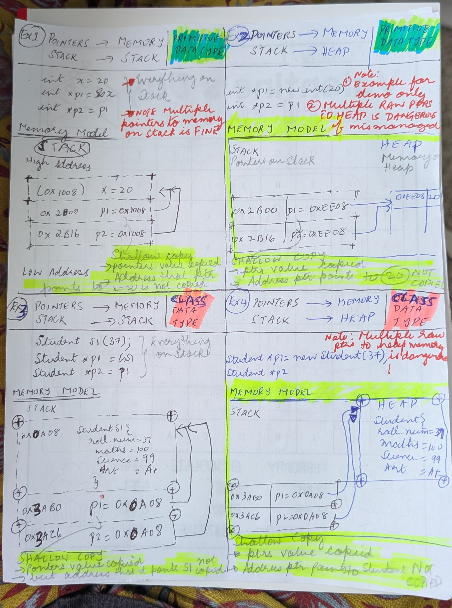


### 🎯 2.3) SHALLOW COPY PROBLEMS
Two pointers (from 2 different classes ) could point to the same memory. This could lead to all sorts of problems like
- i) doible deletion
-ii) Both pointers trying to modify the same memory location. You don't realise both are modifying the same location. This is one of the hardest bugs to solve. This leads to data corruption
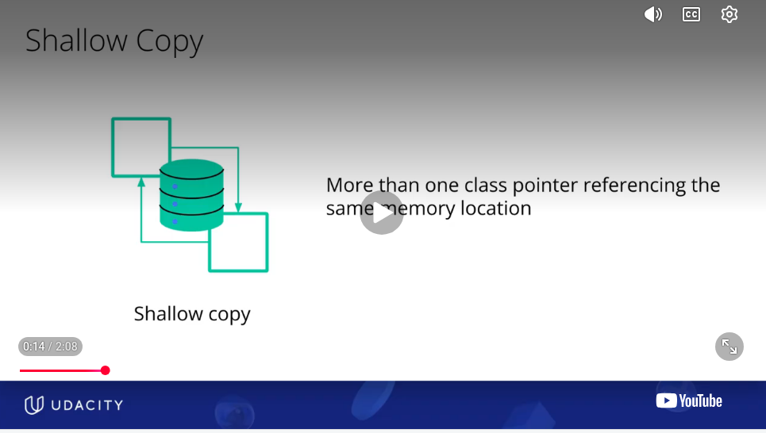
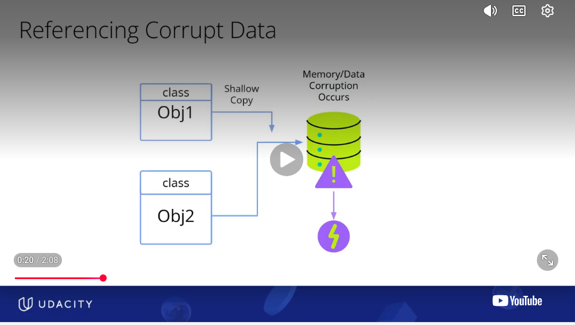


## 🎯 3) COPYING A OBJECT
This is a shallow copy by default. You would have to take care of rule of 3 or/& rule 5. Take care of copy semantics \
See ## CODE DISCUSSION-2 :  Shallow Copy, Deep Copy, Copying Objects, Copy constructors , Copy Assignment Operator, Rule of 3-5

### 🎯 3.1) CUSTOM COPY CONSTRUCTORS
copy constructor in C++ is a special constructor that creates a new object as a copy of an existing object.

```
# Syntax
ClassName(const ClassName& other);
```
- const ClassName& other is a reference to the object being copied.
- Passing by reference avoids an infinite loop of copying.
- const ensures the original object isn't modified.

### 🎯 3.2) CUSTOM COPY ASSIGNMENT OPERATOR

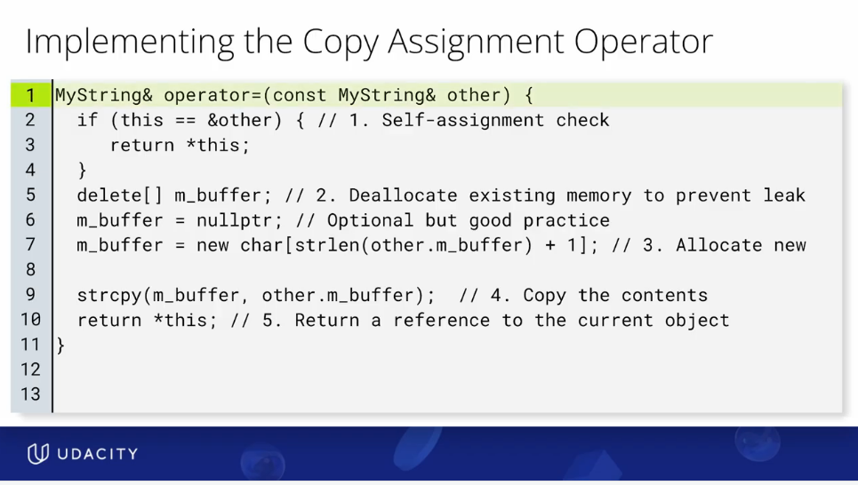 

### 🎯 3.3) Custom  Copy Constructors vs Custom Copy Assignment Operator
Inside the code what you do is the same except some differences
- i)copy constructor is invoked during initialization. 
   - so no need to check if s2 == s1
-  ii) since cpy constructor it is during initialization, s2 is definitaly new, it would not have pointed to anything else . so no need to release anything
  - but in case of custom copy operator, s2 could have been pointing to its own dynamic data. need to release that first to prevent memory leak
other than the above differences the implementation inside each function/ method remains the same
 
### 🎯 3.4) Robustness (swap idiom): 
Robustness (swap idiom): For more complex classes, the copy-and-swap idiom is a safer and exception-safe way to implement assignment.
Disclaimer : I have never implemented this 


## 🎯 4) PASSING & RETURNING OBJECTS 

### 🎯 4.2) PASSING OBJECTS BY VALUE
This involves several copies and several destructor calls
- copy the object to the function argument
- deal with the local copy in the function etc

### 🎯 4.2) RETURNING OBJECTS BY VALUE
-  Never Return a Local Pointer in a function
-  Never Return a Local Reference
-  Can you Return a Class OBJET, By Value: Yes of course you can return them by value ! but there are clauses
- What about returning a class object from a function that has a pointer inside it. are you returning the class by by value ? what about the pointer inside it. So when copying the class by value, is that a shallow copy or deep copy ?
    - returning a object by value is totally fine as long as the object has primitive data types only as the class members
    - if the object has non primitive data types such as a pointer, other classes(that possibly have pointers), things get more complicated. you would have to follow the rule of 5 and obey the copy and move semantics. 
    - This because when you return this class by value, for member pointers and member classes , that would be a shallow copy by default. The pointer inside the class is copied i.e the pointer's value is the the memory address that it points to. This memory address/value is copied. But the entire variable or object at that memory address is not duplicated ( this memory address could be in heap or stack. But it is not duplicated)


## 🎯 5) RULE OF THREE / RULE OF FIVE/ RULE OF ZERO
Rule of Three is Fundamental to
- safe deep copy of pointers
- safe deep copy of classes
- safe passing and returning of class objects by value

### 🎯 5.1) RULE OF THREE
The **RULE OF THREE** says: \
If your class needs a custom implementation of any one of these three, it probably needs custom implementations of all three.
- **Destructor	:** Clean up owned resources
  - A class should delete what it owns, not simply everything it has a pointer to. 
  - Whenever a class manages a resource that is not managed by its members or by another object, it should take care to delete it, in its destructor.
  - This resource could be dynamically allocated memory, but could also be network sockets, locks, file handles, database connections etc
- **Copy constructor :** Create a new object by copying
- **Copy-assignment operator :** Copy into an existing object


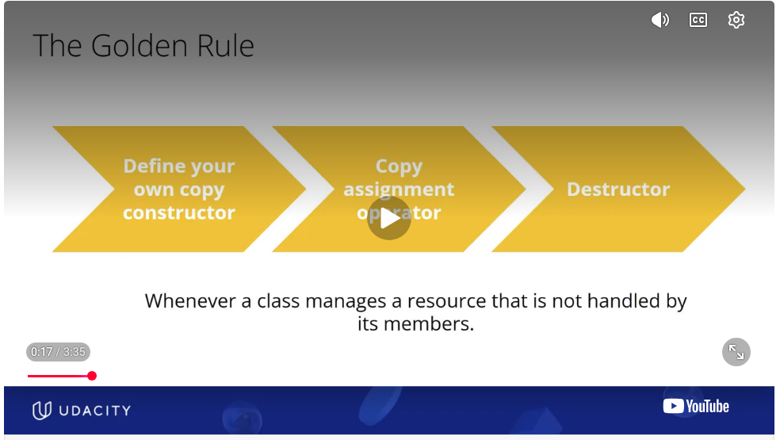 
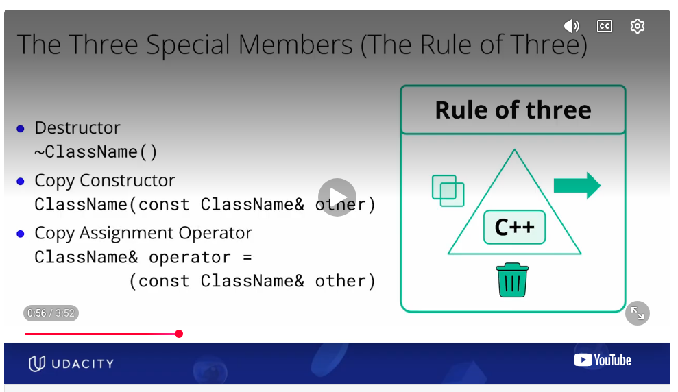
Types of resources being handled is not just dynamically allocated memory
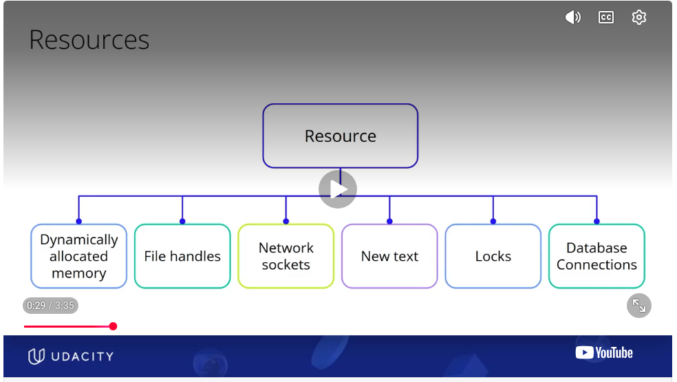


### 🎯 5.2) RULE OF FIVE
In C++11 and later the rule of 3 evolves to a rule of 5. Rule of 5 says, that if you need any of the 3, custom destructor, custom copy constructor, or custom copy-assignment operator, you must implement the move constructor, and move-assignment operator as well.

**The Rule of FIVE/ What value does Rule of 5 bring**

  
- But Deep Copying is expensive. Especially for large objects, deep copying is not viable always
- Wherever appropriate moving might be more efficient/ less expensive than deep copying. What if we new an object is going to get destroyed anyway. Like when returning an object from  a function. In this case moving is much less costlier than deep copying
- Rule of 5 implements the move constructor , & move-assignment operator for better move semantics. \ This is the value add of rule of 5


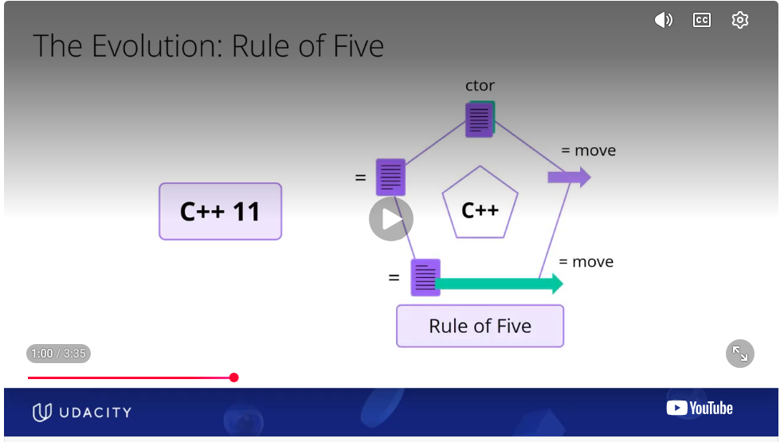 
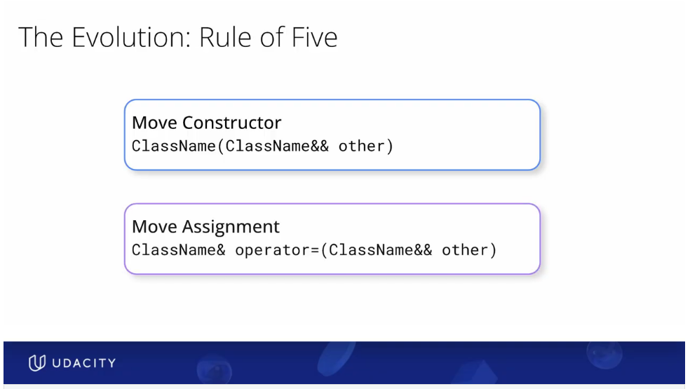

- the double ampersand is actually an rvalue reference


### 🎯 5.3) RULE OF ZERO
Modern C++ rule is The Rule of Zero
- Modern C++ rule is dont manage raw pointers yourself at all. That way you don't need to worry about custom anything: none of the ~~ custom destructor, custom copy constructor, custom copy assignment operator, custom move constructor, custom move assignment operator~~. No need to worry about ~~rule of three~~ or ~~ rule of five~~
- Just use standard c++ libraries, use smart pointers, unique pointers etc, so that you write robust error free code. The compiler will take care of the deep copies and destroying and releasing resources (dynamic memory, locks, sockets or whatever it is)

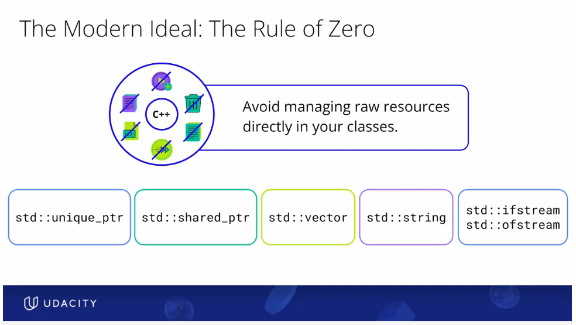


## 🎯 6) LVALUES vs RVALUES

- lvalue = an expression that identifies an object with a persistent location
- rvalue = usually a temporary value, or a value whose resources can be moved from

```
int x = 10;
int y = 20;

x;          // lvalue
y;          // lvalue

x + y;      // rvalue
10;         // rvalue
x * 2;      // rvalue
```

### 🎯 6.1) References to RVALUES
Question: what is the use of creating references to rvalues \
Answer: 
- “This object is temporary / disposable, so I can steal its resources instead of copying them.” 
- THIS IS THE FOUNDATION OF MOVE SEMANTICS i.e not just rvalues, it is rvalue references
- THIS IS WHAT HAPPENS IN MOVE CONSTRUCTOR & MOVE-COPY ASSIGNMENT OPERATOR


## 🎯 CODE DISCUSSION-1 : Wrapper around raw pointers

See : [L5_smart_memory_management/ksw_demo1a_wrapper_around_raw_pointers.cpp](../L5_smart_memory_management/ksw_demo1a_wrapper_around_raw_pointers.cpp)

- demo1 :  
  key concepts: raw pointers
- demo2: raii like abstraction.
    - acquire and initialize in constructor
    - destroy in destructor
    - does not obey rule of 3/5 though
    - demo2a vs demo2b: 
        - which of these 2 is better. KSW TODO: Draw memory Diagram for below piece of code
    ``` 
        # Demo 2a
        StudentWrapper stuwrap1 = StudentWrapper();
        StudentWrapper stuwrap2 = StudentWrapper(51);
        
        # Demo 2b
        StudentWrapper stuwrap1;
        StudentWrapper stuwrap2(51);
    ```
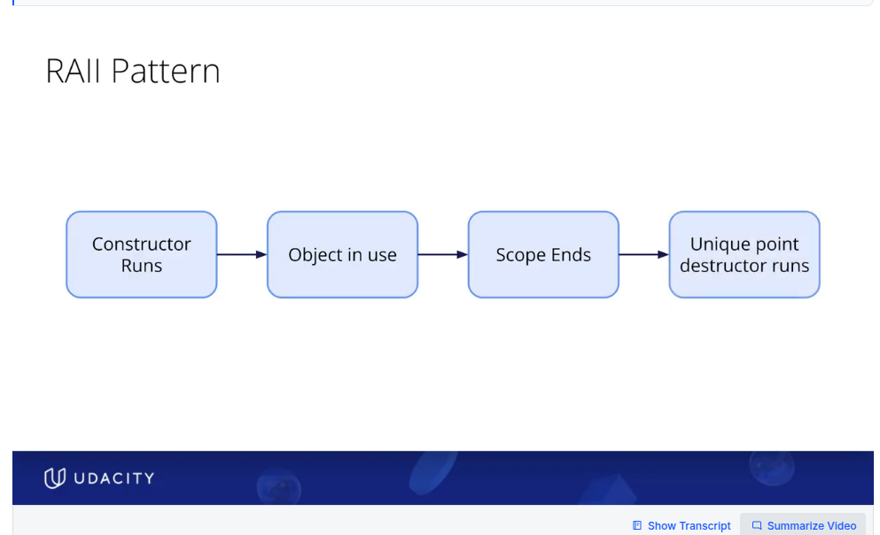
- demo3a:
    - causes memory leak despite raii type implementation. 
    - also causes dangling pointer, & double deletion
    - This because rule of 3/5 not obeyed, it also exposes a raw pointer
    - KSW TODO: Draw memory Diagram for below piece of code
    ``` 
        # Demo 3a
        StudentWrapper stuwrap1 = StudentWrapper();
        stuwrap2 = StudentWrapper(51);
    ```
- demo3b: 
    - fixes the memory leak very unelegantly
    - overall but the point of demos is taken care of though. 
        - you can implement raii principles manually and abstract away the raw pointers from the user
        - but if you dont implement properly, like raw pointers within classes are exposed. Rule of 3/5 are violated. Then it will lead to all sorts of dangerous bugs
  


## 🎯 CODE DISCUSSION-2 :  RULE of 3: Shallow Copy, Deep Copy, Copying Objects, Copy constructors , Copy Assignment Operator, 

### 🎯 CD-2.1) SHALLOW COPY PROBLEMS
See [L4_rule_of_three_five/ksw_demo1a_objects_shallow_copy.cpp](../L4_rule_of_three_five/ksw_demo1a_objects_shallow_copy.cpp) \

This code demonstrates shallow copy 
- i) This code correctly allocates the dynamic memory in the constructor and releases it the destroyer. 
     So there is no exposure to the raw pointers by the user. this is goog
- ii) But this code does not implement a custom copy constructor. 
      Hence It shows how double deletion occurs when there is no custom copy constructor

### 🎯 CD-2.2) RULE OF 3: DEEP COPY
See [L4_rule_of_three_five/ksw_demo2a_objects_deep_copy.cpp](../L4_rule_of_three_five/ksw_demo2a_objects_deep_copy.cpp)

This code builds on top of : L4_rule_of_three_five/ksw_demo1a_objects_shallow_copy.cpp

**This code demonstrates RULE OF THREE: in the context of DEEP COPY**
Student class implements the RULE OF THREE: 
- ~Student(); destructor that takes care of delete
- Student(const Student& other); copy constructor
- Student& operator=(const Student& other); custom copy assignment operator
- i) This code correctly allocates the dynamic memory in the constructor and releases it the destructor
     So there is no exposure to the raw pointers by the user. this is good
     destructor demonstrates that it only destroys the memory it owns and manages i.e ptr2 and assistant_tptr2. ot doesnt delete the memory owned by other pointers
- ii) This code implements a custom copy-assignment operator
      when copying one object to another , it solves the problem of shallow copy and double deletion by using a deep copy,
- iii) This code implements a custom copy constructor. 
       when initialization of a new object from an existing object, it solves the problem of shallow copy and double deletion by using a deep copy,


**In the code PAY ATTENTION to:**
- how deep copy works in the context of the 4 different pointers in Student:4 pointers that deliberately demonstrate different situations
        ptr1:        (non-owning) : points to an integer that is class member (roll num)
        ptr2:            (owning) : points to heap integer memory
        main_tptr:   (non-owning) : points to a teacher object on the stack (external lifetime and scope)
        assistant_tptr2: (owning) : points to a teacher object on heap memory
- **difference between scope and lifetime:** main teacher is created in main but can be accessed within student. demonstrates the difference between scope and lifetime: 
            ```
            Student
            │
            ├── roll_num
            │      ▲
            │      │
            │    ptr1              non-owning internal alias
            │
            ├── ptr2 ────────────► heap int
            │                      OWNING → deep copy
            │
            ├── main_tptr1 ──────► external Teacher
            │                      NON-OWNING → shallow copy
            │
            └── assistant_tptr2 ─► heap Teacher
                                OWNING → deep copy
            ```
- see how deep copies prevent memory errors like double deletion
- pay attention to when copy constructor is called
- when the copy assignment operator is called


### 🎯 CD-2.2) RULE OF 3: PASSING OBJECTS, COPY CONSTRUCTOR, COPY ASSIGNMENT OPERATOR
See [L4_rule_of_three_five/ksw_demo2b_objects_passing_rule_of_three.cpp](../L4_rule_of_three_five/ksw_demo2b_objects_passing_rule_of_three.cpp)

This code builds on top of : 
L4_rule_of_three_five/ksw_demo2a_objects_deep_copy_rule_of_three.cpp

This code demonstrates RULE OF 3: how it is appplicable when passing objects by value \
When passing the object
- pay attention to when **COPY CONSTRUCTOR** is called: called during **INITIALIZATION**
  ```
  Student s3 = pass_and_return_student(s2);
  ```
- when the **COPY ASSIGNMENT OPERATOR** is called: called during **ASSIGNMENT**
  ```
  Student s4;
  s4 = pass_and_return_student(s2);
  ```

Compare with RULE of 5: /L4_rule_of_three_five/ksw_demo4a_objects_passing_move_constructor_rule_of_five.cpp \
The rule of 5 code in contrast shows \
When passing the object \
- pay attention to when move constructor is called (instead of copy constructor)
- when the move assignment operator is called  (instead of move assignment operator)

### 🎯 CD-2.3) DETAILS OF WHAT HAPPENS WHEN: Student s3 = pass_and_return_student(s2);**
    -Student s2(15, 76.0, 100.0, "A+", &main_teacher, "Ms. Chloe" , 1) ; // This calls parameterized constructor
    - s2.pass_return_student(s2);              // s2 gets copied into the pass_return_student argument. it is pass by value. this is copy constructor
    - Student s3 = s2.pass_return_student(s2). // This is initialization. so this is s3's copy constructor
    - Once the above statement completes, after s3 has been created, local argument s2 is destroyed (not the original s2). i.e the student argument's destructor gets called
    - when exiting main s3's destructor gets called
    - then s2's destructor gets called when exiting main

### 🎯 CD-2.4) DETAILS OF WHAT HAPPENS WHEN: Student s4; s4 = pass_and_return_student(s2);**
All steps same as above, except copy assignment operator is called instead of copy constructor

### 🎯 CD-2.5) RULE of 3: SIMPLE CODE  
For a simpler code to see when Copy Constructors are called , When Copy Assignment Operator are called see [text](../L4_rule_of_three_five/udc_demo1_copy_control.cpp)


## 🎯 CODE DISCUSSION-3: RVALUES vs. LVALUES
Rvalues , and specifically rvalue references are the heart beat of move constructors and move assignment operators
See : [L4_rule_of_three_five/ksw_demo3a_rvalue.cpp](../L4_rule_of_three_five/ksw_demo3a_rvalue.cpp)

## 🎯 CODE DISCUSSION-4 :  RULE  of 5: Move constructors , Move Assignment Operator

In c++ the rule of 5 says
If a class manually manages a resource and needs to define one of its special resource-management functions, it will often need to define all five.
| # | Function                     | Purpose                                      | Typical signature                              |
| - | ---------------------------- | -------------------------------------------- | ---------------------------------------------- |
| 1 | **Destructor**               | Releases owned resources                     | `~ClassName()`                                 |
| 2 | **Copy constructor**         | Creates a new object by copying              | `ClassName(const ClassName& other)`            |
| 3 | **Copy assignment operator** | Copies into an existing object               | `ClassName& operator=(const ClassName& other)` |
| 4 | **Move constructor**         | Creates a new object by taking its resources | `ClassName(ClassName&& other)`                 |
| 5 | **Move assignment operator** | Transfers resources into an existing object  | `ClassName& operator=(ClassName&& other)`      |


**RULE of 5 IMPLEMENTATION DETAILS**
- Move Constructors and Move Assignment Operators are not really necessary. But in case of large objects, copying them is very resource heavy. So moving is more efficient
- as far as the moving goes. See below  the memory diagrams
    - anything that is not a pointer on the stack are copied (i.e. int, float, double, even objects etc) 
    - anything that is a pointer on the stack is NOT copied. It is MOVED i.e new object's pointer points to the memory location. old object pointer continues to point to the object on the stack. See main_tptr1
    - anything that is a pointer on the heap is NOT copied. It is MOVED i.e new object's pointer points to the memory location. old object pointer is SET TO NULLPTR.  see assistant_tptr2
    - **notice that the OLD OBJECT WILL BECOME INCOMPLETE. i.e all the pointers pointing to dynamically allocated memory will no longer have any data. THEY ARE ALL NULLPTR. THIS IS OKAY ! They are incomplete, but they are all valid still, since you have set them to nullptr**
    - ~~anything that is not a pointer on the heap .....~~ this is not possible. Everything on the heap is accessed through a pointer. Lol !

**WHAT VALUE DOES RULE OF 5 BRING**
- Rule of 3 is sufficient to make correct deep copies. 
  Rule of 3 is sufficient for the correct passing of objects by value & returning of objects by value
- But Copying is expensive. Wherever appropriate moving might be more efficient/ less expensive than copying
  Rule of 5 implements the move constructor , & move-assignment operator for better move semantics. 
  This is the value add of rule of 5


### 🎯 CD-4.1) MOVING: MEMORY DIAGRAMS  
**BEFORE THE MOVE**
```
STACK                                      HEAP
─────────────────────────                  ─────────────────────

main_teacher @ 0x500
┌──────────────────────┐
│ Teacher "Ms. Renee"  │
└──────────────────────┘
          ▲
          │
          │
s2 @ 0x100
┌──────────────────────────────┐
│ roll_num = 15       @0x100   │◄──────┐
│ math_score = 76              │       │
│ science_score = 100          │       │
│ art_grade = "A+"             │       │
│                              │       │
│ ptr1 = 0x100 ────────────────┘       │
│                                      │
│ ptr2 = 0x800 ───────────────────────────────► ┌─────────────┐
│                                      │        │ int = 1015  │
│                                      │        └─────────────┘
│ main_tptr1 = 0x500 ────────┐         │
│                            │         │
│ assistant_tptr2 = 0x900 ───┼───────────────► ┌─────────────┐
└──────────────────────────────┘         │       │ Teacher     │
                             │           │       │ "Ms Chloe"  │
                             ▼           │       └─────────────┘
                        main_teacher     │
```

**AFTER THE MOVE**
- notice that the OLD OBJECT S2, has BECOME INCOMPLETE. i.e all the pointers pointing to dynamically allocated memory no longer have any data. THEY ARE ALL NULLPTR. THIS IS OKAY ! They are incomplete, but they are all valid still, since you have set them to nullptr
```
STACK                                         HEAP
────────────────────────────────────────────────────────────


main_teacher @0x500
┌─────────────────────┐
│ Teacher "Ms Renee"  │
└─────────────────────┘
       ▲       ▲
       │       │
       │       └───────────────────────────────┐
       │                                       │
s2 @0x100                              s3 @0x200
┌─────────────────────────┐           ┌─────────────────────────┐
│ roll_num = 15           │           │ roll_num = 15           │
│      ▲                  │           │      ▲                  │
│      │                  │           │      │                  │
│ ptr1┘                   │           │ ptr1─┘                  │
│                         │           │                         │
│ ptr2 = nullptr          │           │ ptr2 ───────────────────────► [1015]
│                         │           │
│ main_tptr1 ─────────────┼──────►    │ main_tptr1 ─────────────┘
│                         │           │
│ assistant_tptr2=nullptr │           │ assistant_tptr2 ────────────► Teacher
└─────────────────────────┘           └─────────────────────────┘     "Ms Chloe"
       s2                                      s3
    MOVED-FROM                             NEW OWNER

```

### 🎯 CD-4.1) RULE OF 5: PASSING OBJECTS, MOVE CONSTRUCTOR, MOVE ASSIGNMENT OPERATOR
see [L4_rule_of_three_five/ksw_demo4a_objects_passing_move_constructor_rule_of_five.cpp](../L4_rule_of_three_five/ksw_demo4a_objects_passing_move_constructor_rule_of_five.cpp)

This code demonstrates the RULE OF FIVE
It builds on top of : L4_rule_of_three_five/ksw_demo2b_objects_passing_rule_of_three.cpp

When passing the object
- pay attention to when move constructor is called (instead of copy constructor)
        Student s3 = pass_and_return_student(s2);
- when the move assignment operator is called  (instead of move assignment operator)
      Student s4;
      s4 = pass_and_return_student(s2);

### 🎯 CD-4.2) RULE OF 5: MOVE ASSIGNMENT OPERATOR, std::move
see [L4_rule_of_three_five/ksw_demo4b_objects_move_assignment_rule_of_five.cpp](../L4_rule_of_three_five/ksw_demo4b_objects_move_assignment_rule_of_five.cpp) \

It builds on top of : L4_rule_of_three_five/ksw_demo4a_objects_passing_move_constructor_rule_of_five.cpp \
See relevant README for details c3_memory_management/docs/README_3b_classes_pointers_problems.md \

The Rule of FIVE: Specficially in the context of MOVE ASSIGNMENT OPERATOR AND RVALUES
- Whenever temporary rvalues are involved in the context of assigment, the move assignment operator 
is automatically called 
    ```
    Student s3 ;
    s3 = pass_and_return_student(s2);
    ```
    - The RHS in this case is a temporarily returned local s2, which is an rvalue. 
    - This local s2 has to be copied over to s3 and the local s2 deleted. Hence moving is a better thing, the compiler automatically does this

- use of std::move
   ```
    Student s1;
    Student s2
    s1 = s2; 
   ```
    - s2 is not a rvalue. it is an lvalue. By default the copy assignment operator will be called (even if a move assignment operator has been defined)
    - if you want the move assignment opertator to be called, you must explicitly mention it using std::move
    ```
    s1 = move(s2)
    ```

### 🎯 CD-4.3) DETAILS OF WHAT HAPPENS WHEN: Student s3 = pass_and_return_student(s2);**
All steps same as CD-2.3), except move constructor is called instead of copy constructor


### 🎯 CD-4.4) DETAILS OF WHAT HAPPENS WHEN: Student s4; s4 = pass_and_return_student(s2);**
All steps same as CD-2.4), except move assignment operator is called instead of copy assignment operator

### 🎯 CD-4.5) RULE of 5: SIMPLE CODE  
For a simpler code to see when Move Constructors are called , When Move Assignment Operator are called see \
[L4_rule_of_three_five/udc_demo2a_before_move_assignment_operator.cpp](../L4_rule_of_three_five/udc_demo2a_before_move_assignment_operator.cpp)  \
[L4_rule_of_three_five/udc_demo2b_after_move_assignment_operator.cpp](../L4_rule_of_three_five/udc_demo2b_after_move_assignment_operator.cpp)


## 🎯 CODE DISCUSSION-5 :  Copy vs Move
For an apple to apple comparison of copy constructor vs move constructor, copy assignment operator vs move assignment operator. See the following sets of code \
**Set 1** \
 [L4_rule_of_three_five/ksw_demo2b_objects_passing_rule_of_three.cpp](../L4_rule_of_three_five/ksw_demo2b_objects_passing_rule_of_three.cpp) \
 vs. \
 [L4_rule_of_three_five/ksw_demo4a_objects_passing_move_constructor_rule_of_five.cpp](../L4_rule_of_three_five/ksw_demo4a_objects_passing_move_constructor_rule_of_five.cpp) \
 [L4_rule_of_three_five/ksw_demo4b_objects_move_assignment_rule_of_five.cpp](../L4_rule_of_three_five/ksw_demo4b_objects_move_assignment_rule_of_five.cpp)


**Set 2** \
[L4_rule_of_three_five/udc_demo2a_before_move_assignment_operator.cpp](../L4_rule_of_three_five/udc_demo2a_before_move_assignment_operator.cpp) \
vs. \
[L4_rule_of_three_five/udc_demo2b_after_move_assignment_operator.cpp](../L4_rule_of_three_five/udc_demo2b_after_move_assignment_operator.cpp)

**Example of std::move** \
 [L4_rule_of_three_five/ksw_demo4b_objects_move_assignment_rule_of_five.cpp](../L4_rule_of_three_five/ksw_demo4b_objects_move_assignment_rule_of_five.cpp)