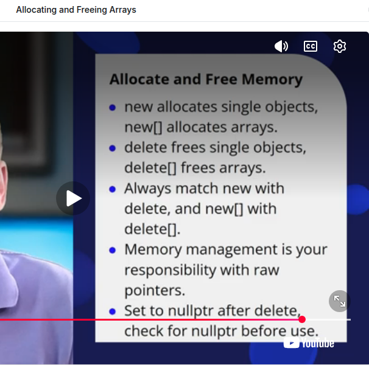
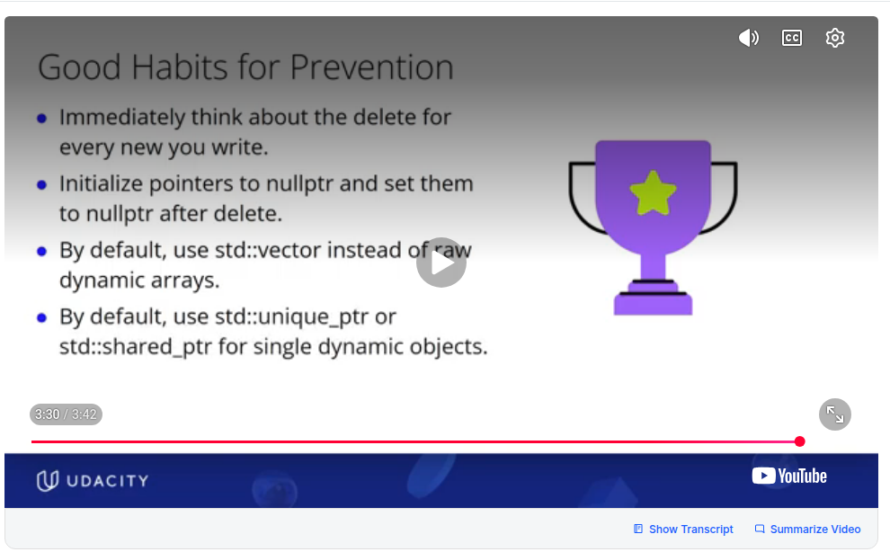
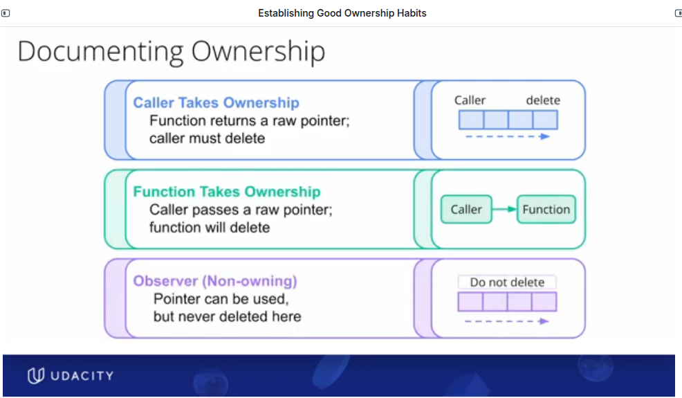

# 🎯 1) MEMORY OWNERSHIP

- Memory ownership is the concept that a specific part of your program (e.g., a variable, a class, a function) has the sole responsibility for managing the lifetime of a dynamically allocated resource, particularly for ensuring its deallocation.
- **The Owner's Responsibilities:**
    - **Allocation:** The owner typically performs or initiates the new operation.
    - **Lifetime Management:** Ensures the resource is available for as long as it's needed.
    - **Deallocation:** Ensures delete is called exactly once when the resource is no longer needed.
    - **NullPtr:** After delete, the owner's pointer should be set to nullptr to avoid dangling pointers. Borrowers should also be aware if the memory they point to might be deleted by the owner.

- **Non-Owners (Borrowers):**
    - Other parts of the code might hold pointers to the same memory, but they are 'borrowers' or 'observers.' They use the memory but do not delete it. But once the owner has deleted the memory,borrowers should also be aware if the memory they point to might be deleted by the owner.
    - They rely on the owner to manage the memory's lifetime.


# 🎯 2) MEMORY, POINTERS & REFERENCES: CARDINAL RULE

- 1) DONT USE RAW POINTERS EVER ⚠️/ use them rarely. Instead try**RAII**: **RESOURCE ALLOCATION IS INITIALIZATION**: RAII shows up in all the following use cases
    - memory allocation, deallocation
    - file handling
    - mutex handling
    - database connection acquisition
    - resources are acquired in the constructor and released in a destructor: because when a raii object goes out of scope, or due to an exception, its destructor is guaranteed to be called
    - in the context of memory allocation, deallocation raii provides 2 classes for dealing with dynamic memory  **std::unique_ptr, std::shared_ptr. use these SMART POINTERS** wherever possible,

- 3) DONT USE RAW POINTERS EVER ⚠️/ use them rarely. You could try the following as well
    - use c++ stl containers like <vector>
    - use references wherever possible

- 4) for dynamic memory: if you really have to use raw pointers ⚠️ (again dont use them)
    - for single objects like int floats etc, the order is new-->use_in_code ---> delete --> nullptr, 
    - for arrays: new[]-->use_in_code ---> delete[] --> nullptr. Dont forget the square brackets for delete
    - you would also have to set all shared pointers to nullptr. see example 2
    - this will prevent memory leaks , and dangling pointers
    ```
    # Example 1
    ptr1 = new   --> code with pointer --> delete ptr1   --> ptr1 = nullptr
    ptr2 = new[] --> code with pointer --> delete[] ptr2 --> ptr2 = nullptr
    DO NOT reassign the pointer to another address or any such thing until you finish the critical path
    If there are if-else statments in 'code with pointer', ensure that all paths obey the critical path
    ```
    
    ```
    # Example 2
    int *ptr1 = new int(10);
    int *ptr2;
    ptr1;
    *ptr1 = 15;

    delete ptr1 ; // delete once. dont delete both ptr1 and ptr2. that would be double deletion
    ptr1 = nullptr ; // prevent ptr1 from becoming dangling
    ptr2 = nullptr;  // prevent ptr2 from becoming dangling
    ```
     
    


- 5) for dynamic memory more complex objects: if you really have to use raw pointers ⚠️ (again dont use them)
    - use the **"Rule of Three/Five"** .  If your class manually manages a resource (like a raw pointer to dynamic memory), it generally needs a custom destructor, copy constructor, and copy assignment operator (and potentially move constructor/assignment operator).
    - This is highly complex. The preferred solution is to avoid raw owning pointers in classes altogether.

- 6) For dynamic memory: if using raw pointers 
    - **YOU MUST DOCUMENT WHO MANAGES WHAT**
    

- 7) For dynamic memory: if using raw pointers 
    - **DONT DOUBLE DELETE**

- 8) whether using smart pointers or raw pointers, 
    - **BE MINDFUL OF OWNERSHIP AND FOLLOW THE MEMORY OWNERSHIP RULES IN SECTION 1**

- 9) for static memory: create pointer---> assign address--->then dereference (otherwise you are accessing a wild pointer)

- 10) within functions never return the following 
    - a local pointer
    - a pointer to a local variable. 
    - the address of a local variable 
    - a local reference  
    NOTE: you can return a local variable through ! Lol ! . Its the regular return by value !!!

- 11) when using a reference, the reference lifetime, scope should end before the memory on heap/ stack ends. Because a **DANGLING REFERENCE CANNOT BE REASSIGNED**


