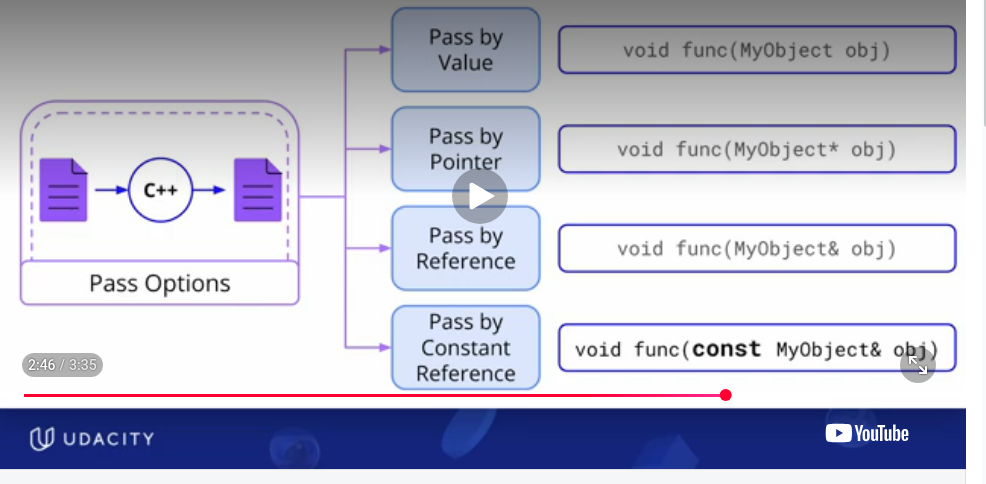
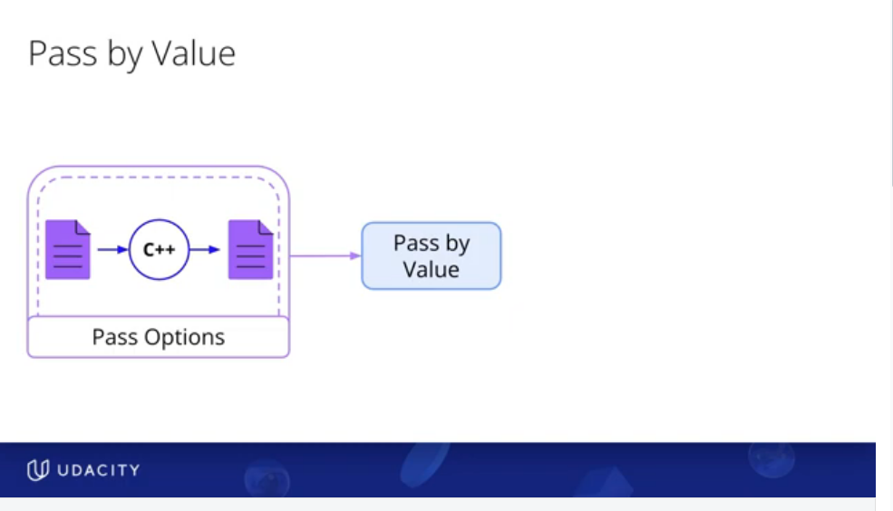
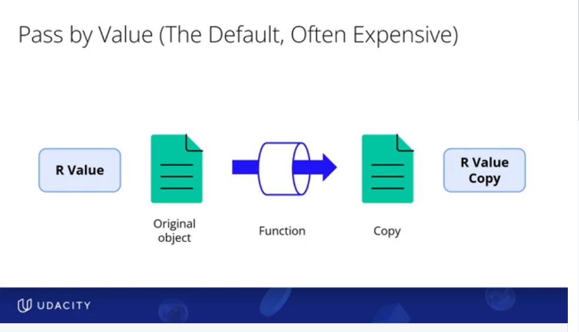
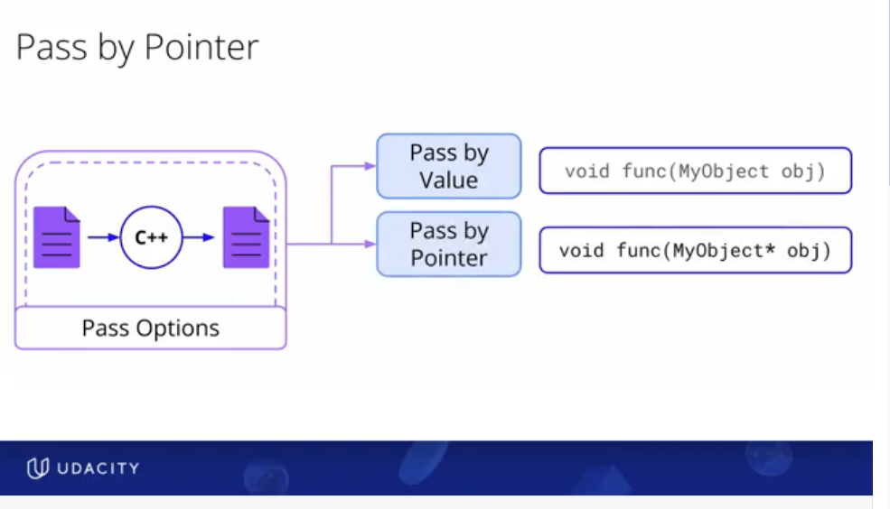
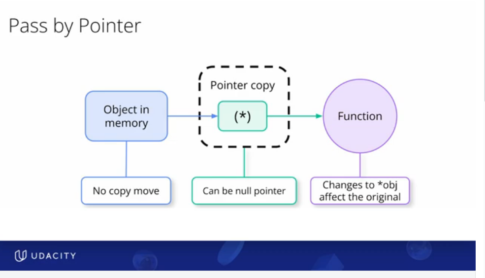
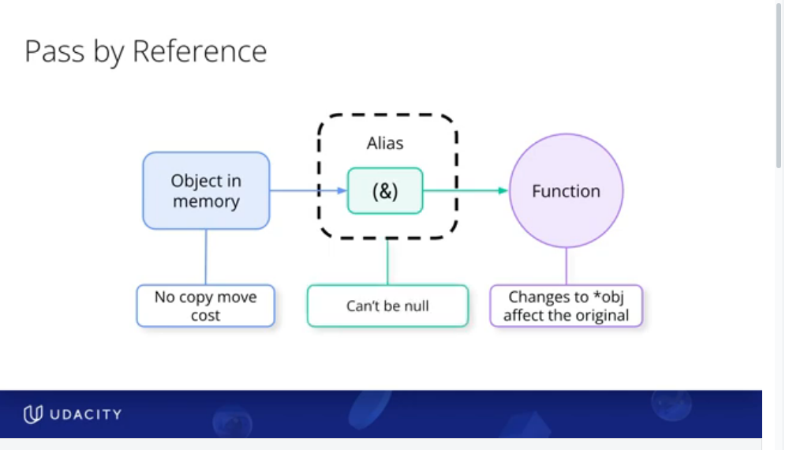
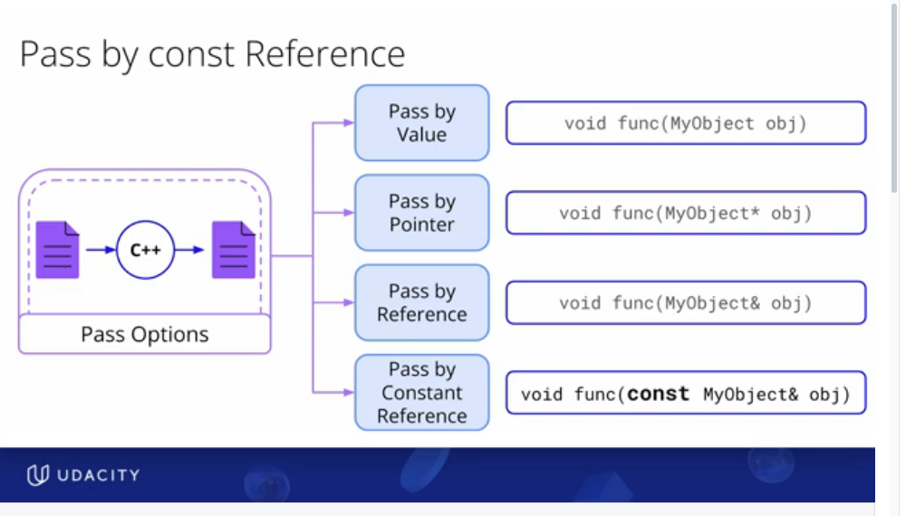

## 🎯 1) : PASSING OBJECTS

- pass by value
- pass by pointer
- pass by reference
- pass by constant reference

Key ideas when passing objects
- are you copying
- are you moving
- neither copying/ nor moving

 

### 🎯 1.1) : PASSING OBJECTS: PASS BY VALUE
- **MOST EXPENSIVE OF ALL.** need to make a copy of the object to pass. / or move it
- Could be a copy or move based on what is being passed 
    - if you are passing a lvalue copy constructor is called
    - if you are passing a rvalue move constructor is called
- suitable for small objects. very very expensive for large objects
- any local changes made to the object will not reflect in the parent object

 

### 🎯 1.2) : PASSING OBJECTS: PASS BY POINTERS
- not expensive. no copies of the object are made/ no moves either.  **ONLY A COPY OF THE POINTER ADDRESS IS MADE** (this is important)
- useful for when you want to modify the original object within the function
- useful when , you dont want copies made, but you also **want the option of an empty object (i.e nullptr)**
- since nullptr is an option, must check for nullptr before dereferencing
CONS
- **the syntax is clunky, must use dereferncing to access the variable.**

 
 

### 🎯 1.3) : PASSING OBJECTS: PASS BY REFERENCE
- not expensive. no copies are made of the object itself. Similar to pass by pointers
- except there is no dereferencing, so syntax IS NOT CLUNKY LIKE POINTERS
- useful for when you want to modify the original object within the function
- **no option of empty object/ null object** (DISADVANTAGE)
- since nullptr is NOT an option, NO NEED TO CHECK FOR nullptr before dereferencing (ADVANTAGE)

 
 

### 🎯 1.3) : PASSING OBJECTS: PASS BY CONSTANT REFERENCE
- same as pass by reference. no copies of the object are made. only an alias/reference to the object is passed. **EXCEPT the alias is a constant i.e NO MODIFICATIONS CAN BE MADE**
- **MOST EFFICIENT OF THEM ALL**

## 🎯 2) : RETUNING OBJECTS

- return by value
- return by pointer
- return by reference
