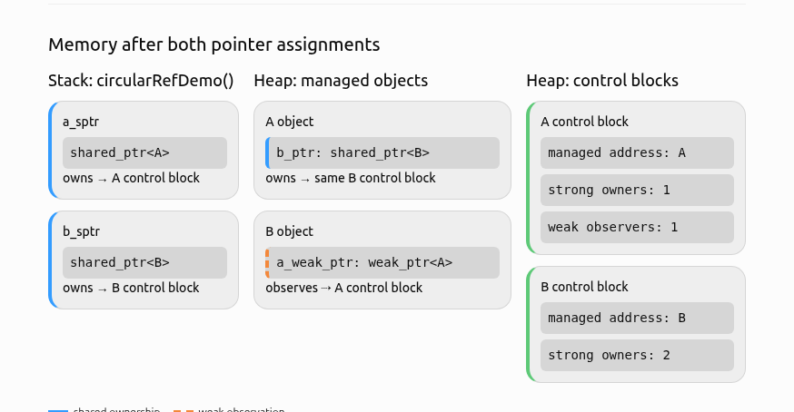
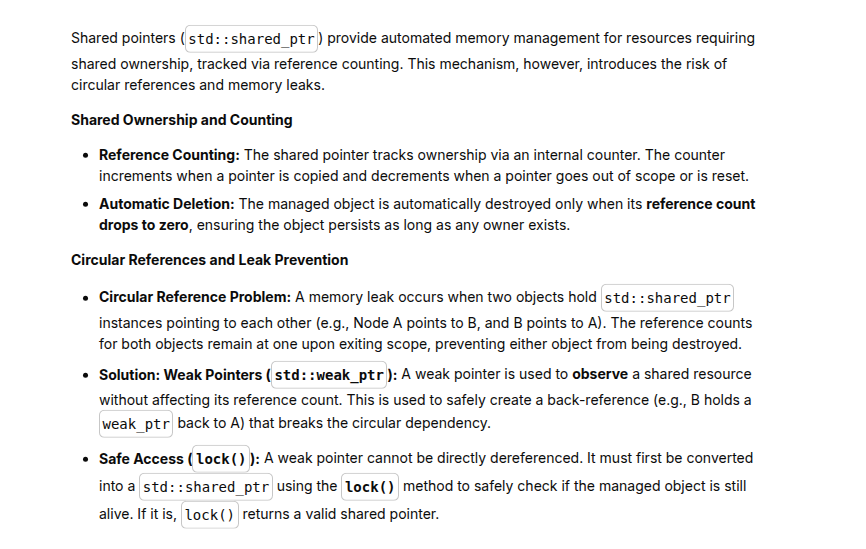
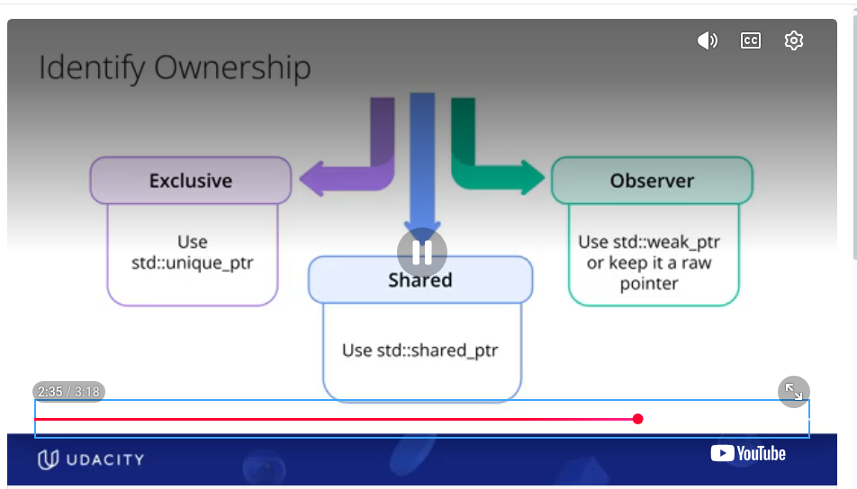
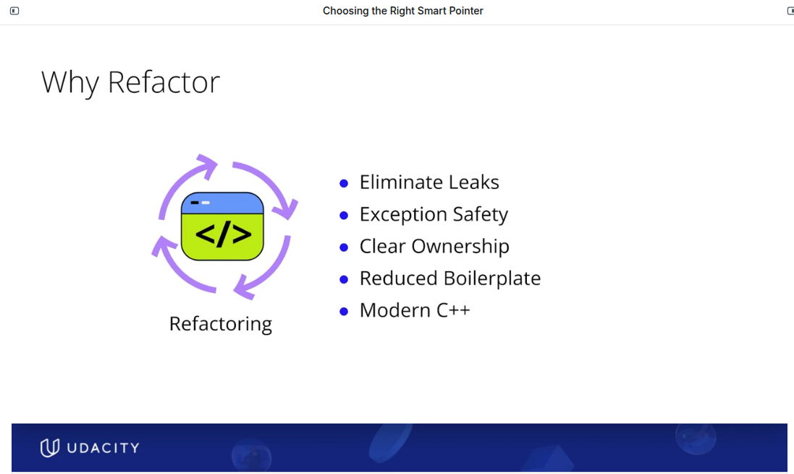
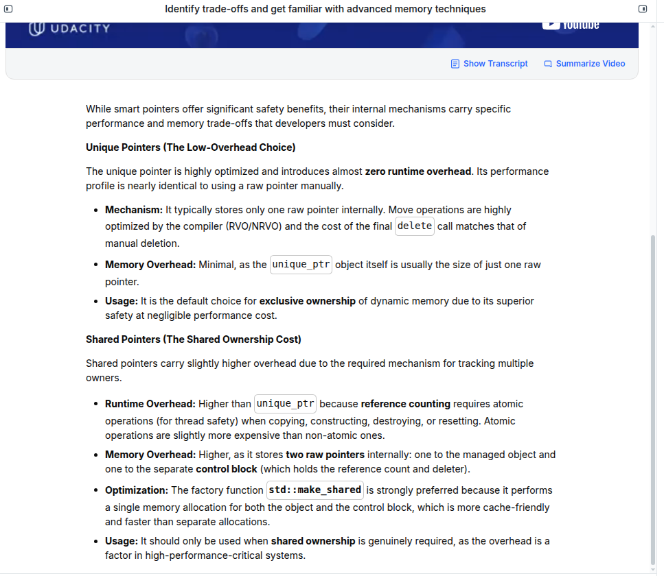
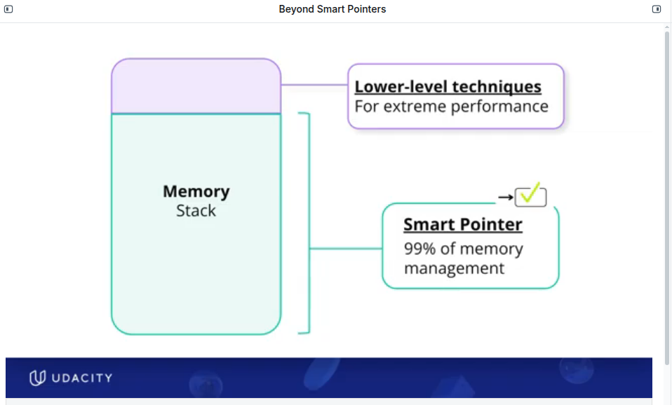
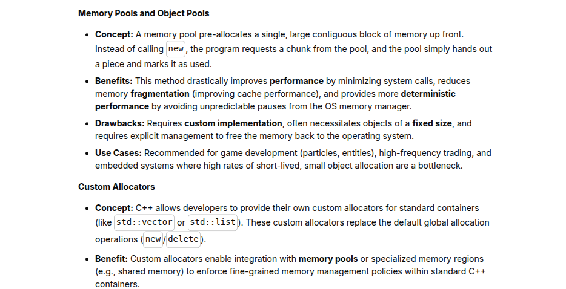

# 🎯 1) SMART POINTERS
- smart pointers are a raii wrapper around raw pointers
- corner stone of modern c++ memory management, helps avoid a lot of the major problems that arise from dealing with raw pointers. They save a lot of COGNITIVE OVERLOAD, & saves a lot of bugs
- smart pointes support both single memory ownership and shared memory ownership
    - std:: unique_ptr for exclusive ownership / single memory ownership
    - std:: shared_ptr for shared memory ownership

## 🎯 1.1) Unique Ptr
Unique pointer is used for accessing + managing dynamically allocated memory, with **exclusive ownership** i.e they maintain exclusive ownership to the allocated resources


## 🎯 1.2) Shared Ptr
Shared Pointer: Definition
 


### 🎯 1.2.1) Shared Ptr: Use Cases
- for shared ownership: multiple things own object
- for factory functions: factory function creates an object and multiple shared pointers to the object for those that need (like a factory that churns out shared pointers)
- data structures: graphs and nodes etc. where there might be multiple parents and multiple children


### 🎯 1.2.2) Shared Ptr: Control Block
see section 3.2

## 🎯 1.2.3) Shared Ptr: Circular References
see section 4
This is very common in graph structures, and parent child relationships
**BUT USING 2 SHARED POINTERS THAT REFERENCE EACH OTHER /CIRCULAR REFERENCES CAUSES MEMORY LEAKS !!!!*** LOL SO MUCH FOR USING SMART POINTERS
 

Instead of using two shared pointers referencing each other, use one shared pointer and one weak pointer. **THIS PREVENTS MEMORY LEAKS**




## 🎯 1.3) Weak Pointer
[L5_smart_memory_management/ksw_demo3_weak_ptr_simple_example.cpp](../L5_smart_memory_management/ksw_demo3_weak_ptr_simple_example.cpp)

- Weak pointer is for observing: without  owning
- weak pointers **CAN BE CREATED FROM SHARED POINTERS ONLY, OR FROM OTHER COMPATIBLE WEAK POINTERS** 
- weak pointers cannot be dereferenced directly. You would have to lock it and create a shared pointer to dereference it

```
auto shared = std::make_shared<Student>();
std::weak_ptr<Student> weak1 = shared;
std::weak_ptr<Student> weak2 = weak1;
```


## 🎯 1.3.1) Weak Ptr: Use Cases


## 🎯 1.3.2) Weak Ptr: lock() ( generates a shared pointer though)
- weak_ptr::lock() is not an exclusive lock like a mutex. The name can be misleading. lock(), infact, returns a shared pointer , 
    It means: “If the object still exists, create another shared_ptr that shares ownership of it.”\
    Therefore, locked2 succeeds precisely because the object is still alive. Multiple shared_ptrs are allowed to own the same object.\
    In your code, the ownership count changes like this:

    **test1: use count changes**

    | Point in execution              | Shared owners      |       `use_count()` |
    | ------------------------------- | ------------------ | ------------------: |
    | `shared` is created             | `shared`           |                   1 |
    | `print_shared_info(shared)`     | `shared`           |                   1 |
    | `weak1 = shared`                | `shared`           |                   1 |
    | `print_shared_info(shared)`     | `shared`           |                   1 |
    | Enter `print_weak_info(weak1)`  | `shared`           |                   1 |
    | `locked = weak.lock()`          | `shared`, `locked` |                   2 |
    | Return from `print_weak_info()` | `shared`           |                   1 |
    | `weak2 = shared`                | `shared`           |                   1 |
    | Enter `print_weak_info(weak2)`  | `shared`           |                   1 |
    | `locked = weak.lock()`          | `shared`, `locked` |                   2 |
    | Return from `print_weak_info()` | `shared`           |                   1 |
    | End of `test1()`                | no shared owners   | 0; object destroyed |


## 🎯 2) OWNERSHIP SEMANTICS
What should you define , with type of pointer \
**unique_ptr:**
  - There is no default copy constructor, copy-assignment-operator: you can leave at this, in which case no copying is possible(no shallow copy, no deep copy). **you can only move , this is called transferring ownership**
  - **custom deep copy :** you can define custom copy constructors, custom copy-assignment operators, that perform deep copying. it preserves unique_ptr semantics
**shared_ptr:**
  - The default copy constructor, copy-assignment-operator:  this does a *SHALLOW COPY** you can leave at this, in which case no copying is possible(no shallow copy, no deep copy)
  - custom deep copy : you can define custom copy constructors, custom copy-assignment operators. it preserves unique_ptr semantics

## 🎯 3) CONTROL BLOCKS

### 🎯 3.1) CONTROL BLOCKS: unique_ptr
unique_ptrs don't have a control block, since ownership is unique

### 🎯 3.2) CONTROL BLOCKS: shared_ptr
Only shared pointers have control blocks. \
Control Block consists of the following
- reference count: use_count()
- weak reference count: **THIS IS NOT ACCESSIBLE**
- deleter
Note: When you create a weak pointer from a shared pointer, and do 
weak_ptr.use_count, **it does not give the weak reference count i.e the number of weak pointers. it gives the use_count, i.e the number of shared pointers. There is no way to get the number of weak pointers (fact check this statement please on weak pointer count?? ). This is pretty confusing, but re-read it and see relevant code to wrap your head around it.**
 

```
shared_ptr object
┌──────────────────────────┐
│ Pointer to managed object│─────────────┐
│ Pointer to control block │──────┐      │
└──────────────────────────┘      │      │
                                  ▼      ▼
                     Control block       Managed object
                     ┌────────────────┐   ┌────────────┐
EXPOSED indirectly → │ Strong count   │   │ Object     │
NOT EXPOSED        → │ Weak count     │   │ data       │
EXPOSED conditionally│ Deleter        │   └────────────┘
NOT EXPOSED        → │ Allocator      │
NOT EXPOSED        → │ Other metadata │
                     └────────────────┘

```

### 🎯 3.3) CONTROL BLOCKS: weak_ptr
weak pointer does not have a separate control block. It shares a control block with shared pointers

```
shared_ptr                         weak_ptr
┌──────────────────────┐          ┌──────────────────────┐
│ object pointer       │───► Obj  │ observed pointer     │───► Obj*
│ control-block pointer│────┐     │ control-block pointer│────┐
└──────────────────────┘    │     └──────────────────────┘    │
                            └────────────┬─────────────────────┘
                                         ▼
                               Shared control block
                               ┌────────────────────────┐
EXPOSED indirectly ──────────► │ Strong count           │
NOT EXPOSED ─────────────────► │ Weak/internal count    │
EXPOSED conditionally ───────► │ Custom deleter         │
NOT EXPOSED ─────────────────► │ Allocator information  │
NOT EXPOSED ─────────────────► │ Internal metadata      │
                               │ Possibly object storage│
                               └────────────────────────┘

```


### 🎯 3.4) IMPORTANT INSIGHT: what happens when shared_ptr is destroyed


What happens when shared_ptr is destroyed, but the weak_ptrs still exist. What happens to the weak pointers and control blocks? \
When the strong count reaches zero, the object is destroyed. The control block remains alive as long as weak references still need it.

## 🎯 4) Shared Ptr: CIRCULAR REFERENCES & MEMORY LEAK
see section 4
This is very common in graph structures, and parent child relationships
**BUT USING 2 SHARED POINTERS THAT REFERENCE EACH OTHER /CIRCULAR REFERENCES CAUSES MEMORY LEAKS !!!!*** LOL SO MUCH FOR USING SMART POINTERS
 

Instead of using two shared pointers referencing each other, use one shared pointer and one weak pointer. **THIS PREVENTS MEMORY LEAKS**


Summary of how to avoid circular references and memory leak


## 🎯 4.1) CIRCULAR REFERENCES: CODE DISCUSSION
**See code**: \
See explanation at the beginning of each code and comments throughout 
- [L5_smart_memory_management/ksw_demo5a_circular_ref_all_shared.cpp](../L5_smart_memory_management/ksw_demo5a_circular_ref_all_shared.cpp) 
- [L5_smart_memory_management/ksw_demo5b_circular_ref_shared_weak.cpp](../L5_smart_memory_management/ksw_demo5b_circular_ref_shared_weak.cpp) 
- [L5_smart_memory_management/ksw_demo5c_circular_ref_shared_weak_reverse_declaration.cpp](../L5_smart_memory_management/ksw_demo5c_circular_ref_shared_weak_reverse_declaration.cpp)

**Memory Diagram for Code**


**Key concepts**
- At the very outset, notice that the shared and weak pointers are inside A , B. But the at the high leavel a_sptr and b_sptr are both shared pointers
-3-to-4 different things exist. 
    - i) the shared pointer on the stack: a_sptr, b_sptr
    - ii) the actual object allocated on the heap: A & B
        - iii) the pointes within the objects A::b_shared_ptr, B::a_shared_ptr/ b_weak_ptr. These exist on the heap within the heap objectws
    - iv) the control blocks on the share pointers also on the heap
- There are many different destructors not just ~A(), ~B()
  - destructors for the shared pointers on the stack. a_sptr.~shared_ptr(), b_sptr.~shared_ptr()
  - destructors for the objects on the heap ~A(), ~B()
  - destructors for the shared or weak pointers inside A or B
    - A::b_shared_ptr.~shared_ptr()
    - B::a_shared_ptr.~shared_ptr() or B::a_weak_ptr.~weak_ptr()
- See the code output for each code, and compare it with the "TRUE VARIABLE DESTRUCTION SEQUENCE" . Reason through the disrepancies

**More Code** \
There is more code on circular references here. But it does not have comments/ explanation
- my code: [L5_smart_memory_management/ksw_demo4a_shared_ptr_circular_reference.cpp](../L5_smart_memory_management/ksw_demo4a_shared_ptr_circular_reference.cpp) 
- my code: [L5_smart_memory_management/ksw_demo4b_unique_ptr_circular_reference.cpp](../L5_smart_memory_management/ksw_demo4b_unique_ptr_circular_reference.cpp)
- udc code: [udc_demo2_shared_weak_circular.cpp](../L5_smart_memory_management/udc_demo2_shared_weak_circular.cpp)

## 🎯 5) COPYING AND MOVING WITH Unique and Shared Ptrs: Code discussion
- [L5_smart_memory_management/ksw_demo2a_raw_ptrs.cpp](../L5_smart_memory_management/ksw_demo2a_raw_ptrs.cpp)  
- [L5_smart_memory_management/ksw_demo2b_unique_ptr_with_custom_copy.cpp](../L5_smart_memory_management/ksw_demo2b_unique_ptr_with_custom_copy.cpp) 
- [L5_smart_memory_management/ksw_demo2c_unique_ptr_without_custom_copy.cpp](../L5_smart_memory_management/ksw_demo2c_unique_ptr_without_custom_copy.cpp) 
- [L5_smart_memory_management/ksw_demo2d_shared_ptr.cpp](../L5_smart_memory_management/ksw_demo2d_shared_ptr.cpp) 

**ksw_demo2a_raw_ptrs.cpp**
- uses raw pointers , **new, and delete**: hence it is not desirable
- obeys the rule of 5. so implements the following
    - custom destructor
    - custom copy constructor
    - custom copy assignment operator
    - custom move constructor
    - custom move assignment operator

**ksw_demo2b_unique_ptr_with_custom_copy.cpp**
- replaces the raw pointers ksw_demo2a_raw_ptrs.cpp with **unique_ptr**
- obeys the rule of 5. The following are default 
    - default destructor
    - default move constructor
    - default move assignment operator
- The following are custom implementations: unique_ptr cannot be copied, so no defaults exist for the following copy constructor & copy assignement operator. Custom ones are needed for deep copy
    - custom copy constructor: this implement deep copy, 
    - custom copy assignment operator: this implements


 **ksw_demo2c_unique_ptr_without_custom_copy.cpp**
- replaces the raw pointers ksw_demo2a_raw_ptrs.cpp with **unique_ptr**
- Only the following defaults exist
    - default destructor
    - default move constructor
    - default move assignment operator
- The following are custom implementations: unique_ptr cannot be copied, so no defaults exist for the following. Custom ones are needed for deep copy
    - custom copy constructor: this implement deep copy, 
    - custom copy assignment operator: this implements


 **ksw_demo2d_shared_ptr.cpp**
- replaces the raw pointers ksw_demo2a_raw_ptrs.cpp with **shared_ptr**
- obeys the Rule of zero: no need to define anything custom , defaults exist for everything
    - default destructor
    - default copy constructor
    - default copy assignment operator
    - default move constructor
    - default move assignment operator
- because of the shared_ptr, the default copy and copy assignment are not deep copies. This creates a shallow, shared-ownership copy:
        ```
        c1.engine_ptr1 ──┐
                        ├──> same Engine
        c2.engine_ptr1 ──┘

        ```
- you could possibly define deep copying custom-copy-constructors and custom-copy-assignment-operators, but that would completely mess up the shared pointer / shared owner semantics


**Testing: UNIQUE_PTR, SHARED_PTR**
 - i)  printing the address of the pointers
 - ii) use static_assert to see if copying, copy-assignment, moving, move-assignments are possible. 
       - unique ptrs: copying, copy-assignment are POSSIBLE IF AND ONLY IF custom deep copy methods have been defined. so it is possible in ksw_demo2b_unique_ptr_with_custom_copy.cpp. It is not possible for ksw_demo2c_unique_ptr_without_custom_copy.cpp
 - iii) use reference count: 
        - reference count only exists for shared_ptrs. 
        - reference_count **DOES NOT EXIST** for unique_ptrs


## 🎯 6) REFACTORING: WHICH POINTER TO USE

 


### 🎯 6.1) Why should we refactor code ?** 


### 🎯 6.2) Which Pointer to Choose** 
**The Real Options:  are only 2 pointers to choose from**: unique_ptr, shared_ptr
- unique_ptr, shared_ptr are the default choice for factory functions
- Unique Ptr: for unique ownership
     - one owner only , one resource
     - be default it cannot be copied, it can be moved only. If you want to copy, you would have to define a custom deep copy
     - default choice for newly created objects, unless shared ownership is reallly required
- Shared Ptr: for shared ownership
    - multiple owners
    - resource is delete when the last owner is gone
    - uses reference counting
    - by default shallow copy only. There is no rule that custom deep copy should not be used 

**Other Options**
- Weak Ptr: is used in conjunction with Shared Ptr to break circular dependencies only. Notice that weak ptr cannot be dereferenced. 
    - non owning obeserver
    - You would have to lock() and generate a shared_ptr to dereference and access the data
    - does not affect the resource lifetime
- If for whatever reason Neither Unique not Shared ptr can be used, Use new+ delete , new[]+delete[] , rule of 5 etc.

**unique_ptr vs shared_ptr**


## 🎯 7) BEYOND SMART POINTERS
 - Memory pools
 - custom allocators

 below slides are from Udacity
 
 